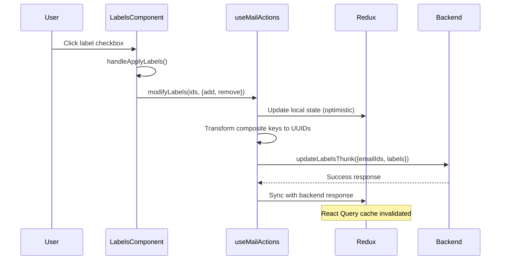
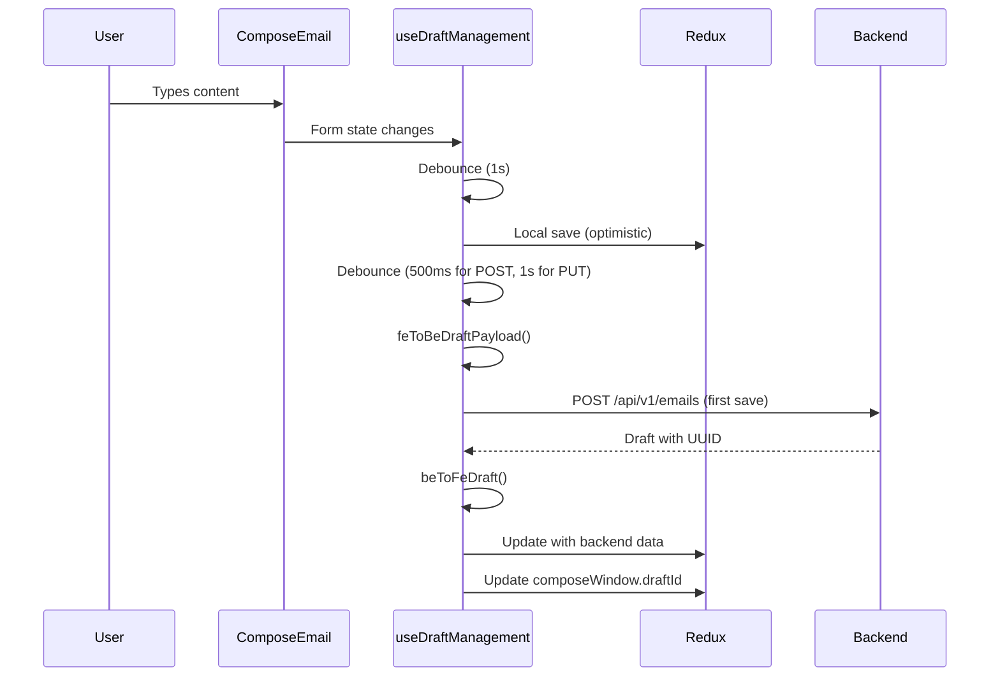
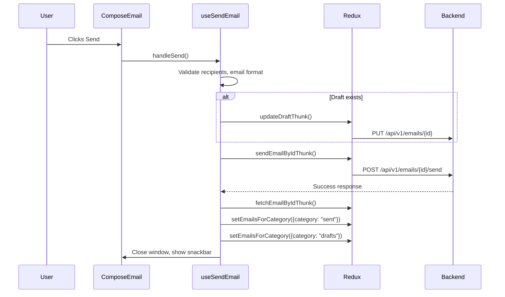
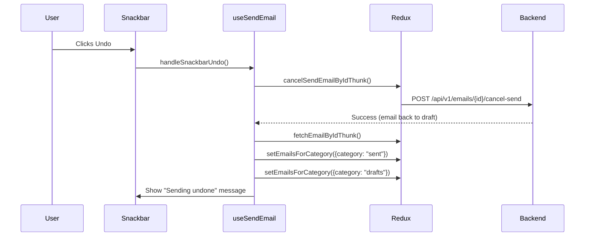
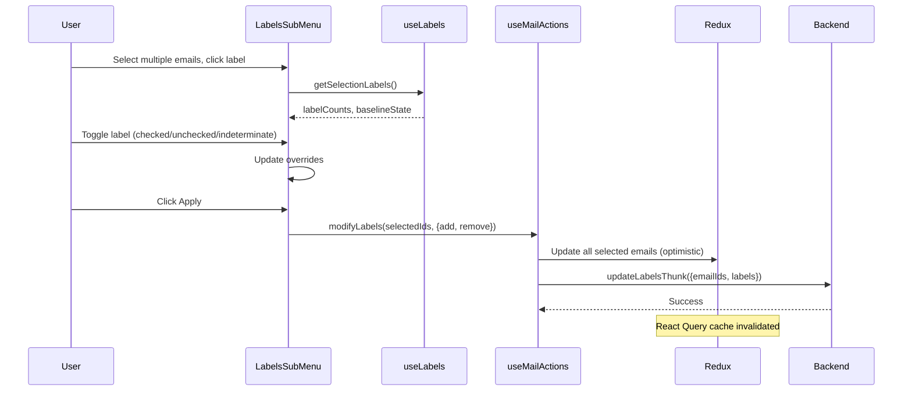
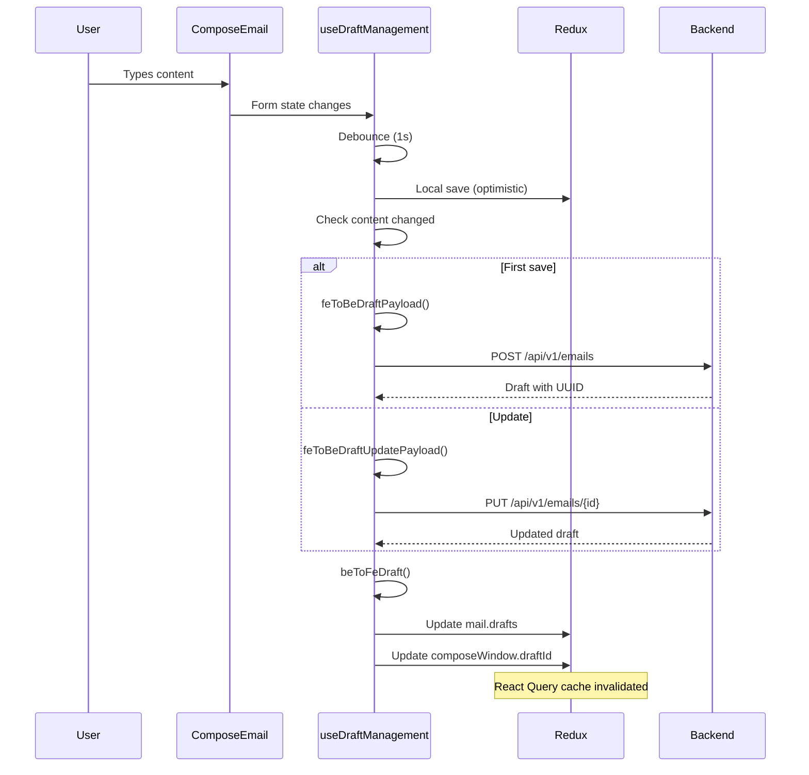
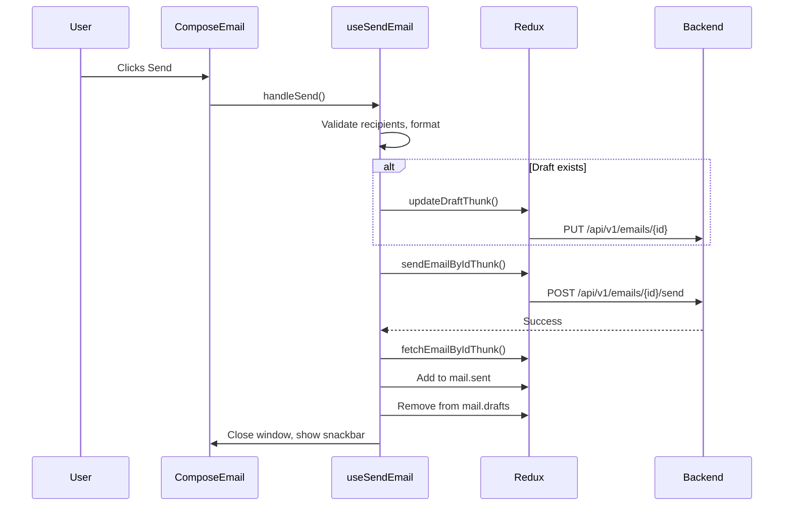
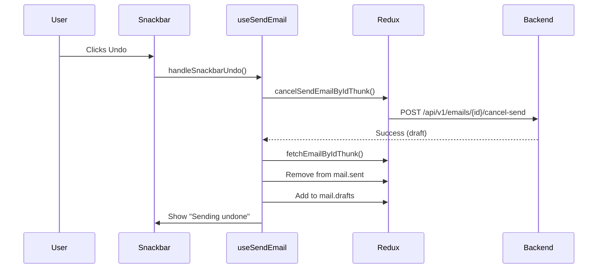
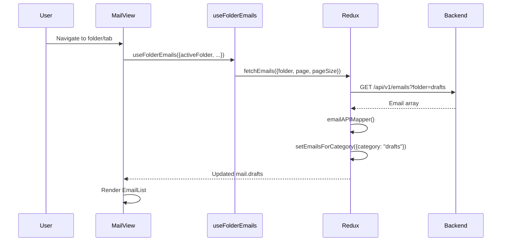
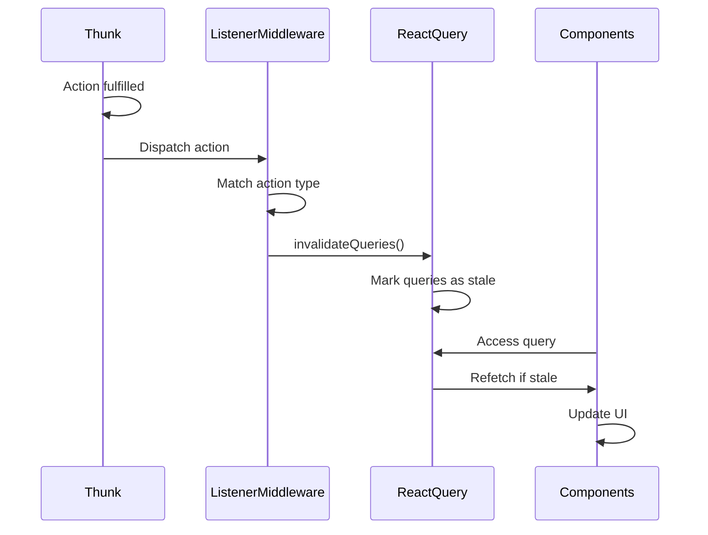

# Frontend Architecture Documentation

## Table of Contents

1. [Overview](#overview)
2. [Redux State Architecture](#redux-state-architecture)
3. [Label System Architecture](#label-system-architecture)
4. [React Query Implementation](#react-query-implementation)
5. [Tab Loading Flow](#tab-loading-flow)
6. [Draft Flow](#draft-flow)
7. [Send Email Flow](#send-email-flow)
8. [Un-send Email Flow](#un-send-email-flow)
9. [Attachment Flow](#attachment-flow)
10. [Compose Flow](#compose-flow)
11. [Data Flow Diagrams](#data-flow-diagrams)
12. [File Reference Index](#file-reference-index)

---

## Overview

This document provides comprehensive technical documentation for the frontend architecture of the email application. It covers:

- **Redux State Management**: Complete store structure, state organization, and update patterns
- **Label System**: Frontend and backend label formats, transformation system, and attachment flows
- **React Query**: Configuration, query key structure, cache invalidation, and data fetching patterns
- **Tab Loading**: Email fetching, data transformation, and state updates when loading folders/categories
- **Draft Management**: Creation, updates, loading, and synchronization with backend
- **Send/Un-send**: Complete flows for sending emails and canceling sent emails
- **Attachments**: File handling, validation, storage, and integration with drafts/send
- **Compose Flow**: Detailed step-by-step flow from compose button click to draft creation

Each section includes:
- **Data Formats**: How data looks in Redux, from backend APIs, and in UI components
- **Mapper Functions**: Transformations between frontend and backend formats
- **Function Call Sequences**: Exact flow of function calls with file locations
- **State Changes**: Before/after Redux state for each operation
- **API Integration**: Endpoints, request/response formats, and error handling

---

## Redux State Architecture

### Store Structure

The Redux store is organized into multiple slices. The main slices relevant to email functionality are:

#### Mail Slice (`src/store/slices/mailSlice.js`)

**Initial State**:
```javascript
{
  mail: {
    // Folder/Category-based email storage
    inbox: [],              // Inbox emails (default view)
    is_starred: [],         // Starred emails
    is_snoozed: [],         // Snoozed emails
    sent: [],               // Sent emails
    drafts: [],             // Draft emails
    is_important: [],       // Important emails
    scheduled: [],          // Scheduled emails
    all: [],                // All mail (inbox + archived)
    spam: [],               // Spam emails
    trash: [],              // Trashed emails
    
    // Category-based email storage (for inbox tabs)
    primary: [],            // Primary category emails
    promotions: [],         // Promotions category emails
    social: [],             // Social category emails
    updates: [],            // Updates category emails
    
    // Label system
    labels: {},             // Object mapping label UUIDs to label objects
    labelIdToKeyMap: {},   // Map: { [uuid]: compositeKey } (e.g., "550e8400..." -> "Work::Clients")
    keyToLabelIdMap: {},   // Map: { [compositeKey]: uuid } (e.g., "Work::Clients" -> "550e8400...")
    
    // UI state
    selectedEmails: [],    // Array of selected email IDs
    previewEmailId: null,  // Currently previewed email ID
    softRemovedLabels: {}, // Temporarily removed labels (for undo)
    emailCounts: {},       // Email counts by category
    
    // Loading states
    loading: false,         // General loading state
    mutationLoading: false, // Loading state for mutations
    labelLoading: false,    // Loading state for label operations
    error: null,            // Error state
    
    // Active filters
    activeCategory: null,   // Currently active category
    activeFolder: null,     // Currently active folder
  }
}
```

**State Update Patterns**:

1. **Thunks**: Async operations (fetch, create, update, delete) use `createAsyncThunk`
   - Examples: `fetchEmails`, `createDraftThunk`, `updateDraftThunk`, `sendEmailByIdThunk`
   - Location: `src/store/slices/mailSlice.js`

2. **Reducers**: Synchronous state updates
   - `setEmailsForCategory`: Updates specific category arrays (inbox, drafts, sent, etc.)
   - `setLabels`: Updates labels object
   - `setLabelIdToKeyMap` / `setKeyToLabelIdMap`: Updates label mappings
   - Location: `src/store/slices/mailSlice.js` (reducers section)

3. **Extra Reducers**: Handle thunk lifecycle (pending, fulfilled, rejected)
   - Automatically update loading states
   - Store fetched data in appropriate category arrays
   - Handle errors

#### Compose Slice (`src/store/slices/composeSlice.js`)

**Initial State**:
```javascript
{
  compose: {
    composeWindows: []  // Array of compose window objects
  }
}
```

**Compose Window Structure**:
```javascript
{
  id: 1234567890,                    // Unique timestamp ID
  draftId: "550e8400-...",          // Draft email ID (UUID or null)
  isMinimized: false,                // Window minimized state
  isMaximized: false,                // Window maximized state
  fields: {                          // Preset fields for reply/forward
    to: [...],
    cc: [...],
    bcc: [...],
    subject: "...",
    content: { html: "...", plainText: "..." },
    replyingTo: emailObject,
    forwardingTo: emailObject,
    replyType: "reply" | "replyAll" | "forward"
  },
  autoFocus: true                    // Auto-focus input on mount
}
```

**Actions**:
- `setComposeWindows`: Replace entire composeWindows array
- `addComposeWindow`: Add new window to array
- `removeComposeWindow`: Remove window by ID

### State Population Flow

1. **Initial Load**: 
   - App starts with empty arrays/objects
   - `fetchEmails` thunk called on route navigation
   - Emails stored in appropriate category arrays

2. **Label Loading**:
   - `fetchLabels` thunk called on app mount
   - Labels transformed and stored in `mail.labels`
   - Mappings created and stored in `labelIdToKeyMap` and `keyToLabelIdMap`

3. **Draft Creation**:
   - Local save: Draft added to `mail.inbox` with local integer ID
   - API save: Draft moved to `mail.drafts` with backend UUID
   - Compose window `draftId` updated

4. **Email Operations**:
   - Send: Email moved from `mail.drafts` to `mail.sent`
   - Un-send: Email moved from `mail.sent` back to `mail.drafts`
   - Label attachment: Email labels array updated in place

---

## Label System Architecture

### Label Data Formats

#### Backend Format

Labels from the backend API (`GET /api/v1/labels`) have this structure:

```javascript
{
  id: "550e8400-e29b-41d4-a716-446655440000",  // UUID
  name: "Work",                                 // Label name
  color: "#e1e3e1",                             // Hex color
  parent_id: null,                              // Parent label UUID (null for root)
  is_system: true,                              // System label flag
  is_exclusive: true,                           // Exclusive label flag (e.g., Spam, Trash)
  email_count: 5                                // Number of emails with this label
}
```

#### Frontend Format

After transformation, labels stored in Redux (`mail.labels`) have this structure:

```javascript
{
  id: "550e8400-e29b-41d4-a716-446655440000",  // UUID (same as backend)
  name: "Work",                                 // Label name
  color: "#e1e3e1",                            // Hex color
  parent_id: null,                             // Parent label UUID
  parentKey: "Work",                           // Composite key for tree building
  system: false,                               // System label flag
  email_count: 5                               // Email count
}
```

**Key Difference**: Frontend adds `parentKey` (composite key like "Work::Clients") for tree structure navigation.

#### Email Label Format

Labels on email objects can be in two formats:

1. **Object Format** (preferred, from backend):
```javascript
labels: [
  { id: "uuid", name: "Drafts", color: "#e1e3e1" },
  { id: "uuid", name: "Work", color: "#ff0000" }
]
```

2. **String Format** (legacy, for system labels):
```javascript
labels: ["Drafts", "Inbox", "Sent"]
```

**Note**: The codebase supports both formats for backward compatibility.

### Label Transformation System

**File**: `src/utils/labelTransform.js`

#### Key Functions

1. **`buildIdToKeyMapping(labelsArray)`**
   - **Input**: Array of backend label objects
   - **Output**: Object mapping `{ [uuid]: compositeKey }`
   - **Purpose**: Converts UUIDs to composite keys (e.g., "Work::Clients")
   - **How**: Recursively traverses `parent_id` relationships to build full path

2. **`buildKeyToIdMapping(idToKeyMap)`**
   - **Input**: `idToKeyMap` object
   - **Output**: Reverse mapping `{ [compositeKey]: uuid }`
   - **Purpose**: Converts composite keys back to UUIDs for API calls

3. **`beToFeLabel(beLabel, idToKeyMap)`**
   - **Input**: Backend label object, ID-to-key mapping
   - **Output**: Frontend label object with `parentKey`
   - **Purpose**: Transforms single backend label to frontend format

4. **`feToBeLabel(feLabel, keyToIdMap)`**
   - **Input**: Frontend label object, key-to-ID mapping
   - **Output**: Backend label object for mutations
   - **Purpose**: Converts frontend label to backend format for create/update

5. **`transformLabelsArray(labelsArray)`**
   - **Input**: Array of backend labels
   - **Output**: `{ labels: {}, idToKeyMap: {}, keyToIdMap: {} }`
   - **Purpose**: Bulk transformation with all mappings

**Why Transformations?**
- **Frontend**: Uses composite keys (e.g., "Work::Clients") for tree structure and UI display
- **Backend**: Uses UUIDs for database relationships
- **Mappers**: Bridge the gap between the two formats

### Label Fetching Flow

**Service**: `src/services/labelService.js`
- **Method**: `getLabels()`
- **Endpoint**: `GET /api/v1/labels`
- **Response**: Array of backend label objects

**Thunk**: `fetchLabels` in `src/store/slices/mailSlice.js`
- Uses React Query: `queryClient.fetchQuery({ queryKey: ["labels"], ... })`
- Cache time: 5 minutes
- Calls `labelService.getLabels()`

**Transformation**:
1. Backend labels received
2. `transformLabelsArray()` called
3. Creates `labels` object, `idToKeyMap`, and `keyToIdMap`
4. Merges with existing system labels

**Redux Update**:
- `mail.labels`: Updated with transformed labels
- `mail.labelIdToKeyMap`: Updated with UUID → composite key mappings
- `mail.keyToLabelIdMap`: Updated with composite key → UUID mappings

### Label Attachment Flow (Single Email)

**Component**: `src/components/MailActions/Labels.jsx`
**Hook**: `useLabels()` from `src/hooks/useLabels.js`
**Action**: `modifyLabels()` from `src/hooks/useMailActions.js`

**Complete Flow**:



**Step-by-Step**:

1. **User Action**: Clicks label checkbox in `Labels.jsx`
2. **Component**: `handleApplyLabels()` determines which labels to add/remove
3. **Hook Call**: `modifyLabels(emailIds, { add: [...], remove: [...] })` called
4. **Local Update**: Redux state updated immediately (optimistic update)
   - Email's `labels` array updated in place
   - UI reflects change immediately
5. **Key Transformation**: Composite keys converted to UUIDs via `keyToLabelIdMap`
   - Example: "Work::Clients" → "550e8400-..."
6. **Backend Sync**: `updateLabelsThunk` dispatched with UUIDs
   - **Thunk**: `src/store/slices/mailSlice.js`
   - **Service**: `emailService.updateLabels(emailIds, labels)`
   - **Endpoint**: `PUT /api/v1/emails/{id}/labels` or batch endpoint
7. **Cache Invalidation**: React Query listener middleware invalidates `["emails"]` and `["labels"]`
8. **State Sync**: Redux state synced with backend response (if needed)

**Files Involved**:
- `src/components/MailActions/Labels.jsx` (UI component)
- `src/hooks/useLabels.js` (Label management logic)
- `src/hooks/useMailActions.js` (modifyLabels function)
- `src/store/slices/mailSlice.js` (updateLabelsThunk)
- `src/services/emailService.js` (API call)
- `src/store/listeners/reactQueryListeners.js` (Cache invalidation)

### Label Attachment Flow (Bulk Emails)

**Component**: `src/components/EmailList/LabelsSubMenu.jsx` or `src/components/MailActions/Labels.jsx`

**State Calculation**:

The system calculates label states across multiple selected emails:

**Function**: `getSelectionLabels()` from `src/hooks/useLabels.js`

```javascript
const { currentLabels, labelCounts, nSel } = useMemo(
  () => getSelectionLabels(selectedIds, folder),
  [getSelectionLabels, selectedIds, folder]
);
```

**Variables**:
- `labelCounts`: Map of `{ [labelKey]: count }` - how many selected emails have each label
- `nSel`: Number of selected emails
- `baselineChecked`: `count === nSel` (all selected emails have the label)
- `baselineSome`: `count > 0 && count < nSel` (some selected emails have the label)
- `baselineState`: 
  - `"checked"` if `baselineChecked`
  - `"indeterminate"` if `baselineSome`
  - `"unchecked"` if `count === 0`

**Override System**:

Users can toggle labels, creating an `overrides` object:
```javascript
overrides = {
  "Work": "checked",        // User toggled to checked
  "Personal": "unchecked",  // User toggled to unchecked
  "Clients": "indeterminate" // User left as-is (indeterminate)
}
```

**Three-State Toggle**:

For labels with `baselineState === "indeterminate"`:
- **Cycle**: Indeterminate → Checked → Unchecked → Indeterminate

For labels with `baselineState === "checked"` or `"unchecked"`:
- **Cycle**: Checked ↔ Unchecked

**Apply Flow**:

Same as single email, but with array of email IDs:
```javascript
modifyLabels(selectedIds, { 
  add: labelsToAdd,      // Array of label keys to add
  remove: labelsToRemove // Array of label keys to remove
})
```

**Backend API**:
- Accepts array of email IDs
- Batch operation: `PUT /api/v1/emails/labels` with `{ emailIds: [...], labels: { add: [...], remove: [...] } }`

---

## React Query Implementation

### Configuration

**File**: `src/lib/query-client.js`

```javascript
export const queryClient = new QueryClient({
  defaultOptions: {
    queries: {
      refetchOnWindowFocus: false,  // Don't refetch on window focus
      retry: 1,                     // Retry failed queries once
      staleTime: 1000 * 60 * 3,     // Data considered fresh for 3 minutes
    },
  },
});
```

**Singleton Pattern**: Single `queryClient` instance exported and used throughout the app.

### Query Key Structure

React Query uses hierarchical query keys for cache organization:

**Emails**:
- `["emails", "inbox", page, pageSize]` - Inbox emails
- `["emails", "folder", "drafts", page, pageSize]` - Drafts folder
- `["emails", "folder", "sent", page, pageSize]` - Sent folder
- `["emails", "category", "primary", page, pageSize]` - Primary category
- `["emails", "is_starred", true, page, pageSize]` - Starred emails
- `["emails", "all", page, pageSize]` - All mail

**Single Email**:
- `["email", emailId]` - Specific email by ID

**Labels**:
- `["labels"]` - All labels

**Email Counts**:
- `["emailCounts"]` - Category email counts

**Why This Structure?**
- Allows granular cache invalidation
- Can invalidate all emails with `["emails"]` or specific queries
- Prevents unnecessary refetches

### Query Usage in Thunks

**Pattern**: Thunks use `queryClient.fetchQuery()` for queries (not mutations)

**Example**: `fetchEmails` thunk in `src/store/slices/mailSlice.js`

```javascript
export const fetchEmails = createAsyncThunk("mail/fetchEmails", async (options = {}, { rejectWithValue }) => {
  // Build query key based on filter type
  let queryKey;
  const filterType = is_starred === true ? "is_starred" : 
                     is_important === true ? "is_important" : 
                     folder ? "folder" : 
                     category ? "category" : "inbox";
  
  switch (filterType) {
    case "folder":
      queryKey = ["emails", "folder", folder, page, pageSize];
      break;
    case "category":
      queryKey = ["emails", "category", category, page, pageSize];
      break;
    // ... other cases
  }
  
  // Use React Query to fetch (with caching)
  const data = await queryClient.fetchQuery({
    queryKey,
    queryFn: () => emailService.getEmailsByFilter({ ...options }),
  });
  
  return data;
});
```

**Benefits**:
- Automatic caching
- Stale-while-revalidate pattern
- Deduplication of concurrent requests
- Background refetching

### Cache Invalidation System

**File**: `src/store/listeners/reactQueryListeners.js`

**Pattern**: Redux listener middleware watches for thunk fulfillments and invalidates React Query cache.

**Invalidation Triggers**:

1. **Draft Operations**:
   - `createDraftThunk.fulfilled` → Invalidates `["emails"]`, `["emailCounts"]`, `["email", emailId]`
   - `updateDraftThunk.fulfilled` → Same as above

2. **Send/Un-send**:
   - `sendEmailByIdThunk.fulfilled` → Invalidates `["email", emailId]`, `["emails"]`, `["emailCounts"]`
   - `cancelSendEmailByIdThunk.fulfilled` → Same as above

3. **Label Operations**:
   - `updateLabelsThunk.fulfilled` → Invalidates `["emails"]`, `["labels"]`, `["emailCounts"]`
   - `createLabelThunk.fulfilled` → Invalidates `["labels"]`, refetches labels, invalidates `["emails"]`
   - `updateLabelThunk.fulfilled` → Same as create
   - `deleteLabelThunk.fulfilled` → Same as create

**Why This Pattern?**
- Ensures UI shows fresh data after mutations
- No manual refetching needed
- Automatic cache synchronization
- Prevents stale data issues

**Example Listener**:

```javascript
listenerMiddleware.startListening({
  actionCreator: createDraftThunk.fulfilled,
  effect: async (action) => {
    const emailId = action.payload?.id;
    if (emailId) {
      queryClient.invalidateQueries({ queryKey: ["email", emailId] });
    }
    queryClient.invalidateQueries({ queryKey: ["emails"] });
    queryClient.invalidateQueries({ queryKey: ["emailCounts"] });
  },
});
```

### Cache Clearing

**On Logout**:
```javascript
listenerMiddleware.startListening({
  actionCreator: logout,
  effect: async () => {
    queryClient.clear();  // Clear all cached queries
  },
});
```

**On Login**:
```javascript
listenerMiddleware.startListening({
  actionCreator: setAuth,
  effect: async () => {
    queryClient.clear();  // Prevent cross-user data leaks
  },
});
```

**Why Clear on Auth Changes?**
- Prevents data from previous user showing
- Security: Ensures no cached sensitive data
- Clean slate for new user session

---

## Tab Loading Flow

### Tab/Folder Navigation

**Component**: `src/pages/MailView.jsx`
**Hook**: `useFolderEmails` from `src/hooks/useFolderEmails.js`
**URL Params**: 
- `folder` (inbox, sent, drafts, starred, important, etc.)
- `label` (custom label name, if viewing label)

### Email Fetching Flow

**Thunk**: `fetchEmails` in `src/store/slices/mailSlice.js`

**Query Key Construction**:

Based on filter type, different query keys are built:

```javascript
// Folder-based
queryKey = ["emails", "folder", "drafts", 1, 20]

// Category-based
queryKey = ["emails", "category", "primary", 1, 20]

// Filter-based
queryKey = ["emails", "is_starred", true, 1, 20]
```

**Service Call**:

- `emailService.getEmailsByFilter()` - For filtered queries (folder, is_starred, etc.)
- `emailService.getEmails()` - For default inbox queries

**API Endpoint**: `GET /api/v1/emails?folder=drafts&page=1&page_size=20`

**Request Parameters**:
- `page`: Page number (default: 1)
- `page_size`: Items per page (default: 20)
- `folder`: Folder name (drafts, sent, trash, spam, inbox)
- `category`: Category name (primary, promotions, social, updates)
- `is_starred`: Boolean filter
- `is_important`: Boolean filter
- `is_snoozed`: Boolean filter
- `include_archived`: Boolean (for "all mail")

### Backend Response Format

```json
{
  "success": true,
  "data": {
    "results": [
      {
        "id": "550e8400-e29b-41d4-a716-446655440000",
        "subject": "Email Subject",
        "body": "Plain text content",
        "html_body": "<p>HTML content</p>",
        "recipients": [
          { "email": "user@example.com", "name": "User Name", "type": "to" },
          { "email": "cc@example.com", "name": "CC User", "type": "cc" }
        ],
        "labels": [
          { "id": "uuid", "name": "Drafts", "color": "#e1e3e1" }
        ],
        "folder": "drafts",
        "category": "primary",
        "is_read": true,
        "is_starred": false,
        "is_important": false,
        "sender_name": "Sender Name",
        "sender_email": "sender@example.com",
        "sender_id": "uuid",
        "created_at": "2024-01-01T00:00:00Z",
        "updated_at": "2024-01-01T00:00:00Z",
        "sent_at": null,
        "received_at": null
      }
    ],
    "total": 100,
    "page": 1,
    "page_size": 20,
    "total_pages": 5
  }
}
```

### Data Transformation

**Mapper**: `emailAPIMapper()` from `src/utils/emails.js`

**Transformations Applied**:

1. **Recipients**:
   - Backend: Single `recipients` array with `type` field
   - Frontend: Separate `to`, `cc`, `bcc` arrays
   ```javascript
   to: recipients.filter(r => r.type === "to")
   cc: recipients.filter(r => r.type === "cc")
   bcc: recipients.filter(r => r.type === "bcc")
   ```

2. **Content**:
   - `html_body` → `body` (HTML content for display)
   - `body` → `preview` (Plain text for preview)

3. **Sender**:
   - `sender_name`, `sender_email`, `sender_id` → `from` object
   ```javascript
   from: {
     name: email.sender_name,
     email: email.sender_email,
     id: email.sender_id
   }
   ```

4. **Labels**:
   - Backend: Array of label objects
   - Frontend: Enriched with object format (ensures consistency)
   - Legacy support: String labels converted to objects

5. **Timestamps**:
   - `sent_at` / `received_at` / `created_at` → `timestamp`
   - Uses first available timestamp

6. **Thread ID**:
   - `thread_id` preserved as-is (UUID)

**Why Transform?**
- Backend format optimized for database/storage
- Frontend format optimized for component rendering
- Mapper ensures consistency across the app

### Redux State Update

**Action**: `setEmailsForCategory({ category: "drafts", emails: [...] })`

**State Update**:
```javascript
// In mailSlice reducer
setEmailsForCategory: (state, action) => {
  const { category, emails } = action.payload;
  if (state.hasOwnProperty(category)) {
    state[category] = emails;  // Updates mail.drafts, mail.sent, etc.
  }
}
```

**Category Mapping**:
- `"drafts"` → `mail.drafts`
- `"sent"` → `mail.sent`
- `"inbox"` → `mail.inbox`
- `"primary"` → `mail.primary`
- `"is_starred"` → `mail.is_starred`
- etc.

**UI Update**:
- Components read from Redux state via selectors
- `useFolderEmails` hook selects appropriate category array
- EmailList component renders emails from Redux

---

## Draft Flow

### Overview

Draft management involves creating, updating, loading, and synchronizing email drafts between the frontend and backend. The system uses a dual-save strategy: local saves for immediate UI feedback and API saves for backend synchronization.

### Mapper Functions for Drafts

**File**: `src/utils/draftMapper.js`

#### `feToBeDraftPayload(to, cc, bcc, subject, content, scheduled_send_at)`

**Purpose**: Transform frontend form data to backend POST payload format.

**Input**:
- `to`, `cc`, `bcc`: Arrays of recipient objects or strings
- `subject`: Email subject string
- `content`: `{ html: string, plainText: string }`
- `scheduled_send_at`: ISO date string or null

**Output**:
```javascript
{
  subject: "Email Subject",
  recipients: [
    { email: "user@example.com", name: "User Name", type: "to" },
    { email: "cc@example.com", name: "CC User", type: "cc" },
    { email: "bcc@example.com", name: "BCC User", type: "bcc" }
  ],
  body: "Plain text content",
  html_body: "<p>HTML content</p>",
  is_draft: true,
  scheduled_send_at: null
}
```

**Why**: Backend expects a single `recipients` array with `type` field, not separate `to`/`cc`/`bcc` arrays.

#### `feToBeDraftUpdatePayload({subject, content, recipients})`

**Purpose**: Transform frontend data to backend PUT payload format.

**Input**:
```javascript
{
  subject: "Updated Subject",
  content: { html: "...", plainText: "..." },
  recipients: [...] // Already formatted with type field
}
```

**Output**:
```javascript
{
  subject: "Updated Subject",
  body: "Plain text",
  html_body: "<p>HTML</p>",
  recipients: [...]
}
```

**Note**: Recipients should already be formatted with `type` field before calling this function.

#### `beToFeDraft(beDraft)`

**Purpose**: Transform backend draft response to frontend email format.

**Input**: Backend draft object from API

**Output**: Frontend email object

**Process**:
1. Uses `emailAPIMapper()` internally to transform recipients, body, etc.
2. Ensures "Drafts" label is present (adds if missing)
3. Handles both string and object label formats

**Why**: Ensures consistency with other email transformations and guarantees draft label presence.

### Draft Creation Flow

**Hook**: `useDraftManagement` from `src/hooks/useDraftManagement.js`

**Flow**:



**Step-by-Step**:

1. **User Types**: Form state updates (to, cc, bcc, subject, content)
2. **Local Save** (1s debounce):
   - Creates draft email object with local integer ID
   - Updates `mail.inbox` via GlobalContext
   - Shows "Draft saved" indicator
3. **API Save** (500ms debounce for first, 1s for updates):
   - **First Save**: `feToBeDraftPayload()` → `createDraftThunk` → `POST /api/v1/emails`
   - **Updates**: `feToBeDraftUpdatePayload()` → `updateDraftThunk` → `PUT /api/v1/emails/{id}`
4. **Backend Response**:
   - `beToFeDraft()` transforms response
   - Updates `mail.drafts` in Redux
   - Updates `composeWindow.draftId` to UUID
5. **Cache Invalidation**: React Query cache invalidated via listener middleware

### Redux State Before/After Operations

**Before Draft Creation**:
```javascript
{
  mail: {
    drafts: [],
    inbox: [...]
  },
  compose: {
    composeWindows: [{
      id: 1234567890,
      draftId: null
    }]
  }
}
```

**After Local Save** (1s after typing):
```javascript
{
  mail: {
    drafts: [],
    inbox: [{
      id: 1001,  // Local integer ID
      labels: ["Drafts"],
      // ... draft data
    }, ...]
  },
  compose: {
    composeWindows: [{
      id: 1234567890,
      draftId: null  // Still null
    }]
  }
}
```

**After API Save** (500ms after local save):
```javascript
{
  mail: {
    drafts: [{
      id: "550e8400-...",  // Backend UUID
      labels: ["Drafts"],
      folder: "drafts",
      // ... backend data
    }],
    inbox: [{
      id: "550e8400-...",  // Same UUID
      // ... same data
    }, ...]
  },
  compose: {
    composeWindows: [{
      id: 1234567890,
      draftId: "550e8400-..."  // Updated to UUID
    }]
  }
}
```

### Draft Update Flow

**Conditional Updates**: Only sends PUT if content has changed (via `hasApiContentChanged()`)

**Flow**:
1. User continues typing
2. Local save (1s debounce) → Immediate Redux update
3. Content change detection → Compares with `lastApiContentRef`
4. If changed: API save (1s debounce) → `updateDraftThunk` → `PUT /api/v1/emails/{id}`
5. Backend response → Update Redux → Update `lastApiContentRef`

**Why Content Change Detection?**
- Prevents unnecessary API calls
- Reduces server load
- Improves performance

---

## Send Email Flow

### Overview

Sending an email involves validation, updating the draft (if applicable), calling the send API, updating Redux state, and showing a success notification with undo capability.

### Send Flow

**Hook**: `useSendEmail` from `src/hooks/useSendEmail.jsx`
**Function**: `sendEmail()` or `handleSend()`

**Complete Flow**:



**Step-by-Step**:

1. **Validation**:
   - Check recipients exist (to, cc, or bcc)
   - Validate email formats
   - Check for blocked attachments
   - Confirm subject (if new email, not reply/forward)

2. **Update Draft** (if draft exists):
   - `feToBeDraftUpdatePayload()` formats data
   - `updateDraftThunk()` → `PUT /api/v1/emails/{id}`
   - Ensures latest content is sent

3. **Send Email**:
   - `sendEmailByIdThunk(emailId)` → `POST /api/v1/emails/{id}/send`
   - **Service**: `emailService.sendEmailById(emailId)`
   - **Endpoint**: `POST /api/v1/emails/{email_id}/send`

4. **Fetch Sent Email**:
   - `fetchEmailByIdThunk(emailId)` → Get complete sent email data
   - `beToFeDraft()` transforms response

5. **Update Redux State**:
   - Add to `mail.sent`: `setEmailsForCategory({ category: "sent", emails: [...] })`
   - Remove from `mail.drafts`: `setEmailsForCategory({ category: "drafts", emails: [...] })`

6. **Store for Undo**:
   - Store sent email data in `lastSentEmailRef.current`
   - Includes `emailId` for un-send API call

7. **Close Window & Notify**:
   - Close compose window
   - Show snackbar: "Message sent" with "Undo" and "View message" buttons

### Backend API

**Endpoint**: `POST /api/v1/emails/{email_id}/send`

**Request**: No body required (email ID in URL)

**Response**:
```json
{
  "success": true,
  "data": {
    "emailId": "550e8400-e29b-41d4-a716-446655440000"
  }
}
```

### Redux State Changes

**Before Send**:
```javascript
{
  mail: {
    drafts: [{
      id: "550e8400-...",
      // ... draft data
    }],
    sent: []
  }
}
```

**After Send**:
```javascript
{
  mail: {
    drafts: [],  // Draft removed
    sent: [{
      id: "550e8400-...",
      labels: ["Sent"],
      folder: "sent",
      // ... sent email data
    }]
  }
}
```

---

## Un-send Email Flow

### Overview

Un-sending (canceling a sent email) allows users to recall an email shortly after sending. The email is moved back to drafts and can be edited and re-sent.

### Un-send Flow

**Trigger**: User clicks "Undo" button in snackbar after sending

**Function**: `handleSnackbarUndo()` in `useSendEmail.jsx`

**Complete Flow**:



**Step-by-Step**:

1. **Get Email ID**: From `lastSentEmailRef.current.emailId`

2. **Cancel Send**:
   - `cancelSendEmailByIdThunk(emailId)` → `POST /api/v1/emails/{id}/cancel-send`
   - **Service**: `emailService.cancelSendEmailById(emailId)`
   - **Endpoint**: `POST /api/v1/emails/{email_id}/cancel-send`

3. **Fetch Updated Email**:
   - `fetchEmailByIdThunk(emailId)` → Get email (now back to draft)
   - `beToFeDraft()` transforms response

4. **Update Redux State**:
   - Remove from `mail.sent`: `setEmailsForCategory({ category: "sent", emails: [...] })`
   - Add to `mail.drafts`: `setEmailsForCategory({ category: "drafts", emails: [...] })`

5. **Clear Ref**: `lastSentEmailRef.current = null`

6. **Show Notification**: "Sending undone." snackbar

### Backend API

**Endpoint**: `POST /api/v1/emails/{email_id}/cancel-send`

**Request**: No body required (email ID in URL)

**Response**:
```json
{
  "success": true,
  "data": {
    "emailId": "550e8400-e29b-41d4-a716-446655440000"
  }
}
```

**Note**: Email status changes from "sent" to "draft" on backend.

### Redux State Changes

**Before Un-send**:
```javascript
{
  mail: {
    sent: [{
      id: "550e8400-...",
      // ... sent email data
    }],
    drafts: []
  }
}
```

**After Un-send**:
```javascript
{
  mail: {
    sent: [],  // Sent email removed
    drafts: [{
      id: "550e8400-...",
      labels: ["Drafts"],
      folder: "drafts",
      // ... draft email data
    }]
  }
}
```

---

## Attachment Flow

### Attachment Handling

**Component**: `src/components/RichTextEditor/RichTextEditor.jsx`
**Function**: `handleNativeFilePickerChange()`

**File Validation**:
- **Size Limit**: 25MB maximum
- **Blocked Extensions**: Dangerous file types (e.g., .exe, .bat, .sh)
- **Storage**: IndexedDB via `db.put("attachments", { id, file })`

**Attachment Metadata Structure**:
```javascript
{
  id: "unique-id",
  name: "document.pdf",
  size: 1024000,  // Bytes
  type: "application/pdf",
  url: "blob:...",  // Object URL for preview
  isBlocked: false,  // True if blocked extension
  isDriveFile: false,  // True if uploaded to Drive (large files)
  driveLink: "https://drive.mailg.com/..."  // Drive link if isDriveFile
}
```

**Large File Handling**:
- Files > 25MB: Show modal asking to upload to Drive
- Creates Drive link instead of attachment
- Link included in email body

### Attachment in Draft

**State**: Attachments stored in `attachments` array in compose component state

**Draft Save**:
- Attachments metadata included in draft email object
- Files stored in IndexedDB with unique IDs
- Backend: Attachments uploaded separately, referenced by attachment IDs

**Backend Format**:
```javascript
{
  // Draft payload
  attachments: [
    { id: "uuid", name: "file.pdf", size: 1024, type: "application/pdf" }
  ]
}
```

### Attachment in Send

**Validation**:
- Check for blocked attachments
- Prompt user: "Send without blocked attachments?"
- Filter out blocked attachments if user confirms

**Send Flow**:
1. Attachments array passed to `sendEmail()` function
2. If draft: Attachments included in `updateDraftThunk` payload
3. Backend: `POST /api/v1/emails/{id}/send` with attachment IDs
4. Backend uploads files and associates with email

**Files Involved**:
- `src/components/RichTextEditor/RichTextEditor.jsx` (File picker, validation)
- `src/hooks/useSendEmail.jsx` (Attachment validation, send)
- `src/hooks/useDraftManagement.js` (Attachment in draft save)

---

## Compose Flow

This section details the complete flow from clicking the compose button to opening a compose window, including all state changes, API calls, and Redux updates.

### Step-by-Step Flow

### 1. **User Clicks Compose Button**

**Location**: `src/components/LeftSidebar/index.jsx` (line 268)

**Action**:
```javascript
onClick={openComposeWindow}
```

**Function Called**: `openComposeWindow` (line 201-206)
```javascript
const openComposeWindow = (e) => {
  const autoFocus = typeof e === "boolean" ? e : true;
  addNewComposeWindow(null, {}, autoFocus);
};
```

---

### 2. **addNewComposeWindow Called**

**Location**: `src/hooks/useComposeModal.js` (line 103-180)

**Parameters**:
- `draftId = null` (no existing draft)
- `fields = {}` (empty fields)
- `autoFocusInput = true` (focus input on open)

**What Happens**:

#### 2.1 Window Creation Logic
```javascript
const newWindow = {
  id: Date.now(),                    // Unique timestamp ID
  draftId: null,                     // No draft ID initially
  isMinimized: false,                // Window starts normal size
  isMaximized: false,                // Not maximized
  fields: {},                        // Empty fields
  autoFocus: true,                   // Auto-focus enabled
};
```

#### 2.2 Window Management
- Checks available screen space
- Calculates max normal windows (max 2)
- If 2+ normal windows exist, minimizes the first one
- Adds new window to the end of the array

#### 2.3 Redux State Update

**Redux Slice**: `src/store/slices/composeSlice.js`

**Action**: `setComposeWindows`

**Redux State Before**:
```javascript
{
  compose: {
    composeWindows: [
      // existing windows...
    ]
  }
}
```

**Redux State After**:
```javascript
{
  compose: {
    composeWindows: [
      // existing windows...,
      {
        id: 1234567890,              // timestamp
        draftId: null,
        isMinimized: false,
        isMaximized: false,
        fields: {},
        autoFocus: true
      }
    ]
  }
}
```

#### 2.4 URL Update
- Updates browser URL: `?compose=new`
- Uses React Router `navigate()` to update URL without page reload

---

### 3. **ComposeEmail Component Renders**

**Location**: `src/components/ComposeEmail/ComposeEmail.jsx`

**Component Receives**: `composeWindow` prop with the new window object

#### 3.1 Initial State Setup

**Local Component State** (lines 50-64):
```javascript
const [to, setTo] = useState([]);
const [cc, setCc] = useState([]);
const [bcc, setBcc] = useState([]);
const [subject, setSubject] = useState("");
const [content, setContent] = useState({
  html: "",
  plainText: "",
});
const [rawInputText, setRawInputText] = useState({
  to: "",
  cc: "",
  bcc: "",
});
```

**Derived Values**:
- `currentDraftId = composeWindow?.draftId` → `null` (new compose)
- `replyingToEmail = null`
- `forwardingEmail = null`
- `composeReplyType = null`

#### 3.2 useDraftManagement Hook Initialization

**Location**: `src/hooks/useDraftManagement.js` (line 23)

**Parameters Passed**:
```javascript
{
  to: [],
  cc: [],
  bcc: [],
  subject: "",
  content: { html: "", plainText: "" },
  currentDraftId: null,              // No draft ID
  parentEmail: null,
  replyType: null,
  composeWindowId: composeWindow.id,
  setComposeWindows: setComposeWindows
}
```

**Hook Internal State** (lines 26-37):
```javascript
const [draftSaved, setDraftSaved] = useState(false);
const [isDraft, setIsDraft] = useState(false);      // No draft initially
const [draftId, setDraftId] = useState(null);
const backendDraftIdRef = useRef(null);             // No backend ID
const isFirstSaveRef = useRef(true);                // Will be first save
```

**Initialization Effect** (lines 40-48):
- Checks if `currentDraftId` is UUID → `false` (it's null)
- Sets `backendDraftIdRef.current = null`
- Sets `isFirstSaveRef.current = true` (first save will be POST)

#### 3.3 Signature Insertion

**Location**: `src/components/ComposeEmail/ComposeEmail.jsx` (lines 112-131)

**useLayoutEffect** runs:
- Checks: `!currentDraftId && !replyingToEmail && !content.html`
- Condition: `true` (new compose, no draft, no reply)
- If signature exists:
  - Inserts signature into `content.html`
  - Updates `content` state via `setContent()`

**State After Signature**:
```javascript
content: {
  html: "<p><br></p><p data-signature=\"true\">Signature HTML</p>",
  plainText: "\nSignature Text"
}
```

#### 3.4 Draft Loading Check

**Location**: `src/components/ComposeEmail/ComposeEmail.jsx` (lines 196-230)

**useLayoutEffect** runs:
- Checks `currentDraftId` → `null`
- Skips draft loading (no draft to load)

**No API Call** at this point (new compose, no draft ID)

---

### 4. **User Starts Typing**

#### 4.1 State Updates
- User types in recipients → `setTo()`, `setCc()`, `setBcc()` called
- User types subject → `setSubject()` called
- User types body → `setContent()` called

#### 4.2 Auto-Save Triggered

**Location**: `src/hooks/useDraftManagement.js` (lines 326-357)

**useEffect** watches: `[to, cc, bcc, subject, content]`

**When Content Changes**:
1. Checks if content is worth saving (`hasDraftContent()`)
2. Clears existing `autoSaveTimeoutRef`
3. Sets new timeout: **1 second**

**After 1 Second**:
- Calls `saveDraft(true)` (isAutoSave = true)

#### 4.3 Local Draft Save

**Location**: `src/hooks/useDraftManagement.js` (lines 247-324)

**saveDraft Function**:

**Step 1**: Validation
- Checks `hasDraftContent()` → must have recipients, subject, or body
- Checks `hasContentChanged()` → compares with previous content

**Step 2**: Create Draft Email Object
```javascript
const draftEmail = {
  id: generateNextIntegerId(emails),  // Local integer ID (e.g., 1001)
  thread_id: generateThreadId(),
  from: { name: loggedInUser.name, email: loggedInUser.email },
  to: [...],
  cc: [...],
  bcc: [...],
  subject: "...",
  body: content.html,
  preview: content.plainText,
  timestamp: new Date().toISOString(),
  labels: ["Drafts"],
  // ... other fields
};
```

**Step 3**: Update Local State

**GlobalContext State Update**:
```javascript
setEmails((prevEmails) => {
  const filteredEmails = prevEmails.filter(
    (email) => email.id?.toString() !== draftId?.toString()
  );
  return [draftEmail, ...filteredEmails];  // Add at beginning
});
```

**Redux State After Local Save**:
```javascript
{
  mail: {
    inbox: [
      {
        id: 1001,                    // Local integer ID
        labels: ["Drafts"],
        // ... draft data
      },
      // ... other emails
    ],
    drafts: []                       // Not updated yet (only on backend fetch)
  }
}
```

**Step 4**: Update Draft ID
```javascript
setDraftId(1001);                    // Local integer ID
setIsDraft(true);
```

**Step 5**: Update Previous Content Reference
- Stores current content for change detection

**Step 6**: Show "Draft saved" Indicator
- Sets `setDraftSaved(true)`
- Clears after 1 second

**Step 7**: Schedule API Call

**API Call Scheduling** (lines 306-319):
```javascript
// Clear existing API timeout
if (apiCallTimeoutRef.current) {
  clearTimeout(apiCallTimeoutRef.current);
}

// Determine if first save
const isFirstSave = isFirstSaveRef.current && !backendDraftIdRef.current;
// isFirstSave = true (no backend ID yet)

// Schedule API call
const delay = isFirstSave ? 1000 : 5000;  // 1 second for first save
apiCallTimeoutRef.current = setTimeout(() => {
  saveDraftToBackend(isFirstSave);
}, delay);
```

---

### 5. **First API Call (POST) - After 1 Second**

**Location**: `src/hooks/useDraftManagement.js` (lines 170-244)

**Function**: `saveDraftToBackend(true)`

#### 5.1 Create Payload

**Mapper Function**: `feToBeDraftPayload()` from `src/utils/draftMapper.js`

**Payload Created**:
```javascript
{
  subject: "User's subject",
  recipients: [
    { email: "user@example.com", type: "to", name: "User Name" },
    // ... cc, bcc recipients
  ],
  body: "plain text content",
  html_body: "<p>HTML content</p>",
  is_draft: true,
  scheduled_send_at: null
}
```

#### 5.2 API Call

**Service**: `src/services/emailService.js` (line 191)

**Endpoint**: `POST /api/v1/emails`

**Request**:
```http
POST /api/v1/emails
Authorization: Bearer <token>
Content-Type: application/json

{
  "subject": "...",
  "recipients": [...],
  "body": "...",
  "html_body": "...",
  "is_draft": true
}
```

**Response** (201 Created):
```json
{
  "success": true,
  "data": {
    "id": "550e8400-e29b-41d4-a716-446655440000",  // Backend UUID
    "subject": "...",
    "body": "...",
    "html_body": "...",
    "folder": "drafts",
    "category": "primary",
    "is_read": true,
    "is_starred": false,
    "is_important": false,
    "sender_id": "...",
    "created_at": "2024-01-01T00:00:00Z",
    "updated_at": "2024-01-01T00:00:00Z"
  }
}
```

#### 5.3 Transform Response

**Mapper Function**: `beToFeDraft()` from `src/utils/draftMapper.js`

**Transformation**:
- Backend format → Frontend format
- Uses `emailAPIMapper()` internally
- Converts recipients array to `to`, `cc`, `bcc` arrays
- Maps `html_body` → `body`
- Maps `body` → `preview`

**Frontend Draft Object**:
```javascript
{
  id: "550e8400-e29b-41d4-a716-446655440000",  // Backend UUID
  to: [{ email: "...", name: "...", id: "..." }],
  cc: [...],
  bcc: [...],
  subject: "...",
  body: "<p>HTML content</p>",
  preview: "plain text",
  labels: ["Drafts"],
  folder: "drafts",
  // ... other fields
}
```

#### 5.4 Update Local State with Backend Data

**GlobalContext Update** (lines 198-216):
```javascript
setEmails((prevEmails) => {
  // Remove local draft (by local ID) and any existing backend draft
  const filteredEmails = prevEmails.filter(
    (email) =>
      email.id?.toString() !== draftId?.toString() &&        // Remove local ID (1001)
      email.id?.toString() !== backendDraft.id?.toString()  // Remove backend UUID if exists
  );
  
  // Add backend draft at beginning
  const updatedEmails = [feDraft, ...filteredEmails];
  
  // Update Redux drafts array
  const drafts = updatedEmails.filter(
    (email) => email.labels?.includes("Drafts") || email.folder === "drafts"
  );
  dispatch(setEmailsForCategory({ category: "drafts", emails: drafts }));
  
  return updatedEmails;
});
```

**Redux State After API Response**:
```javascript
{
  mail: {
    inbox: [
      {
        id: "550e8400-e29b-41d4-a716-446655440000",  // Backend UUID
        labels: ["Drafts"],
        folder: "drafts",
        // ... backend data
      },
      // ... other emails
    ],
    drafts: [
      {
        id: "550e8400-e29b-41d4-a716-446655440000",
        // ... same draft
      }
    ]
  }
}
```

#### 5.5 Update Draft ID References

```javascript
const newBackendId = backendDraft.id;  // UUID
setDraftId(newBackendId);              // Update state to UUID
backendDraftIdRef.current = newBackendId;  // Store in ref
isFirstSaveRef.current = false;       // No longer first save
```

#### 5.6 Update Compose Window Draft ID

**Redux Compose State Update** (lines 225-231):
```javascript
if (composeWindowId && setComposeWindows) {
  setComposeWindows((prev) =>
    prev.map((window) =>
      window.id === composeWindowId 
        ? { ...window, draftId: newBackendId }  // Update to UUID
        : window
    ))
  );
}
```

**Redux State After**:
```javascript
{
  compose: {
    composeWindows: [
      {
        id: 1234567890,
        draftId: "550e8400-e29b-41d4-a716-446655440000",  // Updated to UUID
        // ... other fields
      }
    ]
  }
}
```

#### 5.7 Invalidate React Query Cache

**Cache Invalidation** (lines 233-237):
```javascript
queryClient.invalidateQueries({ queryKey: ["emails", "folder", "drafts"] });
queryClient.invalidateQueries({ queryKey: ["emails", "inbox"] });
queryClient.invalidateQueries({ queryKey: ["emails"] });
queryClient.invalidateQueries({ queryKey: ["emailCounts"] });
```

**Effect**:
- All email queries marked as stale
- Will refetch on next access
- Ensures UI shows latest data

---

### 6. **Subsequent Edits (After First Save)**

#### 6.1 User Continues Typing
- State updates as before
- Auto-save triggers after 1 second

#### 6.2 Local Save
- Same local save process
- Updates local state immediately

#### 6.3 API Call Scheduling
- `isFirstSaveRef.current = false` (already saved)
- `backendDraftIdRef.current = "550e8400..."` (UUID exists)
- Delay: **5 seconds** (instead of 1 second)

#### 6.4 API Call (PUT) - After 5 Seconds

**Function**: `saveDraftToBackend(false)`

**Payload** (via `feToBeDraftUpdatePayload`):
```javascript
{
  subject: "Updated subject",
  body: "Updated plain text",
  html_body: "<p>Updated HTML</p>",
  is_read: true,
  is_starred: false,
  is_important: false,
  folder: "drafts",
  category: "primary"
}
```

**Endpoint**: `PUT /api/v1/emails/{email_id}`

**Request**:
```http
PUT /api/v1/emails/550e8400-e29b-41d4-a716-446655440000
Authorization: Bearer <token>
Content-Type: application/json

{
  "subject": "...",
  "body": "...",
  "html_body": "...",
  // ... other fields
}
```

**Response** (200 OK):
```json
{
  "success": true,
  "data": {
    "id": "550e8400-e29b-41d4-a716-446655440000",
    "updated_at": "2024-01-01T00:01:00Z",
    // ... updated fields
  }
}
```

**Updates**:
- Same state update process as POST
- Updates local state with backend response
- Invalidates cache
- No draft ID change (same UUID)

---

## Redux State Summary

### Initial State (Before Compose)
```javascript
{
  compose: {
    composeWindows: []
  },
  mail: {
    inbox: [...],
    drafts: []
  }
}
```

### After Compose Button Click
```javascript
{
  compose: {
    composeWindows: [
      {
        id: 1234567890,
        draftId: null,
        isMinimized: false,
        isMaximized: false,
        fields: {},
        autoFocus: true
      }
    ]
  },
  mail: {
    inbox: [...],
    drafts: []
  }
}
```

### After First Local Save (1 second)
```javascript
{
  compose: {
    composeWindows: [
      {
        id: 1234567890,
        draftId: null,  // Still null (local save hasn't updated it yet)
        // ...
      }
    ]
  },
  mail: {
    inbox: [
      {
        id: 1001,  // Local integer ID
        labels: ["Drafts"],
        // ... draft data
      },
      // ... other emails
    ],
    drafts: []  // Not updated yet
  }
}
```

### After First API Save (1 second after local save)
```javascript
{
  compose: {
    composeWindows: [
      {
        id: 1234567890,
        draftId: "550e8400-e29b-41d4-a716-446655440000",  // Backend UUID
        // ...
      }
    ]
  },
  mail: {
    inbox: [
      {
        id: "550e8400-e29b-41d4-a716-446655440000",  // Backend UUID
        labels: ["Drafts"],
        folder: "drafts",
        // ... backend data
      },
      // ... other emails
    ],
    drafts: [
      {
        id: "550e8400-e29b-41d4-a716-446655440000",
        // ... same draft
      }
    ]
  }
}
```

---

## Key Timing

1. **User clicks compose** → Immediate
2. **Component renders** → Immediate
3. **User types** → Immediate state updates
4. **Local save** → 1 second after last keystroke
5. **First API call (POST)** → 1 second after local save (total: 2 seconds)
6. **Subsequent API calls (PUT)** → 5 seconds after local save

---

## Error Handling

### API Call Fails
- Error logged to console
- Local save still works (optimistic update)
- User can continue editing
- Next save will retry API call

### Network Issues
- Same as API failure
- Local state preserved
- Draft available locally until connection restored

---

## Notes

1. **Dual ID System**: 
   - Local integer IDs for backward compatibility
   - Backend UUIDs after first API save
   - Transition happens automatically

2. **Optimistic Updates**:
   - Local state updates immediately
   - API calls happen asynchronously
   - UI remains responsive

3. **Cache Invalidation**:
   - React Query cache invalidated after API calls
   - Ensures fresh data on next fetch
   - Prevents stale data issues

4. **Redux Updates**:
   - `composeWindows` updated in Redux
   - `mail.inbox` updated via GlobalContext
   - `mail.drafts` updated via Redux action

---

## ComposeEmail Component - Detailed Explanation

### Overview

The `ComposeEmail` component (`src/components/ComposeEmail/ComposeEmail.jsx`) is the main component responsible for rendering the compose email interface. It supports:
- Multiple simultaneous compose windows
- Draft management (create, update, load, delete)
- Reply/Forward functionality
- Send and schedule operations
- Window management (minimize, maximize, close)
- Signature insertion
- State persistence across window minimize/restore

---

### Component Structure

#### 1. Imports and Setup (Lines 1-25)

**React Hooks**:
- `useState`, `useEffect`, `useLayoutEffect`, `useMemo`, `useRef` - State and lifecycle management
- `useLocation`, `useNavigate` - React Router for navigation

**Redux**:
- `useDispatch` - Dispatch Redux actions
- `fetchEmailByIdThunk`, `setEmailsForCategory` - Draft-related actions

**Custom Hooks**:
- `useComposeModal` - Window management (minimize, maximize, close)
- `useDraftManagement` - Draft auto-save and backend sync
- `useSendEmail` - Send email functionality
- `useScheduleEmail` - Schedule email functionality
- `useGlobalContext` - Global application state

**Utilities**:
- `beToFeDraft` - Transform backend draft to frontend format
- `restructureRecipients` - Optimize recipient lookup

**Helper Function**:
```javascript
const isUUID = (str) => {
  // Checks if a string is a UUID format (backend draft ID)
  // Returns true for: "123e4567-e89b-12d3-a456-426614174000"
  // Used to distinguish backend drafts (UUID) from local drafts (integer)
}
```

---

#### 2. Component Props and Initial Setup (Lines 27-49)

**Component Signature**:
```javascript
export default function ComposeEmail({ composeWindow }) {
```

**Props**:
- `composeWindow`: Object containing:
  - `id`: Unique window ID (timestamp)
  - `draftId`: Draft email ID (if editing existing draft)
  - `isMinimized`, `isMaximized`: Window state flags
  - `fields`: Preset fields (to, cc, bcc, subject, content) for reply/forward
  - `replyingTo`, `forwardingTo`: Original email for reply/forward
  - `autoFocus`: Whether to auto-focus input on mount

**Global Context Access**:
```javascript
const {
  emails,              // All emails in the application
  mailFolders,         // Organized emails by folder (inbox, drafts, sent, etc.)
  setSnackbar,         // Function to show notifications
  recipients,          // Contact list for autocomplete
  composeWindows,      // Array of all open compose windows
  setComposeWindows,   // Function to update compose windows array
  rightSidebarActiveTab, // Sidebar state for positioning calculations
  loggedInUser,        // Current user information
  signaturesState,     // Email signature settings
} = useGlobalContext();
```

**Recipients Memoization**:
```javascript
const restructuredRecipients = useMemo(() => {
  return restructureRecipients(recipients.filter((recipient) => recipient.email));
}, [recipients]);
```
- Creates an optimized lookup structure for recipients
- Only recalculates when `recipients` array changes
- Used for matching email strings to recipient objects

**Window Visibility Calculation**:
```javascript
const isWindowVisible = useMemo(() => {
  const visibleWindows = composeWindows.slice(-visibleWindowCount);
  return visibleWindows.some((w) => w.id === composeWindow.id);
}, [JSON.stringify(composeWindows), visibleWindowCount, composeWindow.id]);
```
- Determines if this window should be visible based on `visibleWindowCount`
- Uses CSS `display: none` to hide non-visible windows (prevents unmounting)
- **Note**: `JSON.stringify(composeWindows)` in dependencies can cause unnecessary re-renders

---

#### 3. Form State Management (Lines 58-72)

**Local Component State**:
```javascript
const [to, setTo] = useState([]);        // Array of recipient objects
const [cc, setCc] = useState([]);        // Array of CC recipient objects
const [bcc, setBcc] = useState([]);     // Array of BCC recipient objects
const [subject, setSubject] = useState(""); // Email subject string
const [content, setContent] = useState({  // Email body content
  html: "",        // HTML content for rich text editor
  plainText: "",   // Plain text version for preview
});

const [rawInputText, setRawInputText] = useState({ // Raw input for validation
  to: "", cc: "", bcc: ""
});
```

**State Structure**:
- **Recipients**: Arrays of objects with `{id, name, email, avatar, ...}`
- **Content**: Object with `{html, plainText}` for dual-format support
- **Raw Input**: Stores unparsed text for email validation

---

#### 4. Reply/Forward Detection (Lines 77-86)

```javascript
const replyingToEmail = composeWindow?.fields?.replyingTo || null;
const forwardingEmail = composeWindow?.fields?.forwardingTo || null;
const composeReplyType = forwardingEmail
  ? "forward"
  : replyingToEmail
    ? composeWindow?.fields?.replyType || 
      (presetCcRecipients?.length > 0 ? "replyAll" : "reply")
    : null;
```

**Determines**:
- **New email**: `composeReplyType = null`
- **Reply**: `composeReplyType = "reply"` or `"replyAll"`
- **Forward**: `composeReplyType = "forward"`

**Used for**:
- Hiding subject field (replies/forwards use original subject)
- Signature insertion (only for new emails)
- Draft thread management

---

#### 5. Draft Management Hook (Lines 90-102)

```javascript
const { 
  saveDraftManually,   // Manually save draft (on close)
  deleteDraft,         // Delete draft from Redux
  isDraft,             // Boolean: is this a draft?
  draftId,             // Current draft ID (local or UUID)
  draftSaved,          // Boolean: "Draft saved" indicator
  hasDraftContent      // Function: checks if form has content worth saving
} = useDraftManagement({
  to, cc, bcc, subject, content,  // Form state
  currentDraftId,                 // Draft ID from composeWindow
  parentEmail: originalEmail,      // Original email (for replies)
  replyType: composeReplyType,     // "reply", "replyAll", "forward", or null
  composeWindowId: composeWindow?.id,
  setComposeWindows,
});
```

**This hook handles**:
- Auto-save with debouncing (1s for local, 500ms/1s for API)
- Backend synchronization (POST for new, PUT for updates)
- Local Redux updates
- Content change detection (prevents unnecessary API calls)
- Draft ID management (local integer → backend UUID transition)

---

#### 6. Signature Management (Lines 104-139)

**Signature Selection**:
```javascript
const defaultSignatureId = useMemo(() => {
  const isReply = composeWindow?.fields?.replyingTo;
  return isReply 
    ? signaturesState?.useForRepliesAndForwards 
    : signaturesState?.useForNewEmails;
}, [composeWindow, signaturesState]);
```

**Signature Insertion**:
```javascript
useLayoutEffect(() => {
  const isNewCompose = !currentDraftId && !composeWindow?.fields?.replyingTo && !content.html?.trim();
  
  if (isNewCompose && defaultSignatureHTML) {
    // Insert signature based on user preference
    // Either before quoted text or with "--" separator
  }
}, [defaultSignatureHTML, currentDraftId, signaturesState?.insertSignatureBeforeQuotedText]);
```

**Key Points**:
- Runs **before paint** (`useLayoutEffect`) to avoid flicker
- Only inserts for **new emails** (not drafts or replies)
- Sanitizes signature HTML (removes wrapping `<p>` tags)
- Supports two insertion modes (before quoted text or with separator)

---

#### 7. Draft Loading Logic (Lines 169-288)

**Main `useLayoutEffect`** that loads draft data when component mounts or draft ID changes:

**Flow**:
1. **Check if `currentDraftId` exists**
2. **Try to find draft in Redux** (`mailFolders?.drafts`)
3. **If found**: Load form fields immediately (no API call)
4. **If not found but is UUID**: Fetch from backend via `fetchEmailByIdThunk`
5. **Transform backend data** using `beToFeDraft()`
6. **Populate form fields** (to, cc, bcc, subject, content)
7. **Update Redux** with fetched draft

**Code Structure**:
```javascript
useLayoutEffect(() => {
  if (currentDraftId) {
    // Load from Redux first
    const drafts = mailFolders?.drafts || [];
    const existingDraft = drafts.find(
      (email) => email.id.toString() === currentDraftId?.toString() 
        && email.labels.includes("Drafts")
    );
    
    if (existingDraft) {
      // Load form fields from Redux
      setTo(existingDraft.to.map(...));
      setCc(existingDraft.cc.map(...));
      // ... etc
    } else if (isUUID(currentDraftId.toString())) {
      // Fetch from backend if not in Redux
      dispatch(fetchEmailByIdThunk(currentDraftId))
        .then((fetchedDraft) => {
          const feDraft = beToFeDraft(fetchedDraft);
          // Load form fields
          // Update Redux
        });
    }
  } else if (composeWindow?.fields && Object.keys(composeWindow?.fields).length > 0) {
    // Load preset fields (for reply/forward)
  }
}, [currentDraftId?.current, composeWindow?.isMinimized, JSON.stringify(composeWindow?.fields), JSON.stringify(restructuredRecipients)]);
```

**Issues**:
- **Line 288**: `currentDraftId?.current` should be `currentDraftId` (not a ref)
- **Line 288**: `JSON.stringify()` in dependencies can cause unnecessary re-runs
- **Line 175**: Label check assumes string format, should support object format

---

#### 8. Editor Focus Management (Lines 290-318)

```javascript
useEffect(() => {
  if (composeWindow?.fields?.replyingTo && composeWindow?.autoFocus && !composeWindow?.fields?.forwardingTo) {
    setTimeout(() => {
      const composeModal = document.querySelector(`[data-compose-id="${composeWindow.id}"]`);
      const editorElement = composeModal.querySelector(".ProseMirror");
      if (editorElement) {
        editorElement.focus();
      }
    }, 300);
  }
}, [composeWindow?.fields?.replyingTo, composeWindow?.autoFocus, composeWindow?.id]);
```

**Purpose**:
- Focuses the rich text editor for **replies** (not forwards)
- Uses 300ms delay to ensure editor is rendered
- Finds editor via DOM query using window ID

---

#### 9. Draft ID Synchronization (Lines 320-327)

```javascript
useEffect(() => {
  if (draftId) {
    setComposeWindows((prev) =>
      prev.map((window) => 
        window.id === composeWindow.id 
          ? { ...window, draftId: draftId } 
          : window
      )
    );
  }
}, [draftId]);
```

**Purpose**:
- Updates `composeWindow.draftId` when draft is created/updated
- Keeps window state in sync with draft state
- Ensures draft can be reloaded if window is closed and reopened

---

#### 10. Window Positioning (Lines 329-354)

```javascript
const composeModalRightPosition = useMemo(() => {
  const windows = composeWindows.slice(-visibleWindowCount);
  const windowIndex = windows.findIndex((window) => window.id === composeWindow.id);
  
  let rightPosition = rightSidebarActiveTab.activeTab ? 390 : 70;
  
  // If last window, return base position
  if (windowIndex === windows.length - 1) {
    return rightPosition;
  }
  
  // Calculate position based on windows to the right
  for (let i = windowIndex + 1; i < windows.length; i++) {
    const window = windows[i];
    const windowWidth = window.isMinimized ? 350 : 550;
    rightPosition += 5 + windowWidth; // 5px gap + window width
  }
  
  return rightPosition;
}, [composeWindows, visibleWindowCount, composeWindow.id, rightSidebarActiveTab.activeTab]);
```

**Purpose**:
- Calculates right position for window stacking
- Accounts for minimized (350px) vs normal (550px) windows
- Adjusts for sidebar state (390px if active, 70px if not)
- Ensures windows don't overlap

---

#### 11. Window Control Handlers (Lines 356-375)

```javascript
const handleToggleMinimize = () => {
  toggleMinimize(composeWindow.id);
};

const handleToggleMaximize = () => {
  toggleMaximize(composeWindow.id);
};

const handleClose = (saveToDraft = true) => {
  if (hasDraftContent() && saveToDraft) {
    saveDraftManually(); // Save before closing
  }
  removeComposeWindow(composeWindow.id);
};
```

**Functionality**:
- **Minimize/Maximize**: Toggle window state
- **Close**: Saves draft if content exists, then removes window

---

#### 12. Send and Schedule Hooks (Lines 377-429)

**Send Email Hook**:
```javascript
const {
  handleSend: handleSendEmail,
  showErrorModal,
  errorMessage,
  handleErrorModalClose,
  handleSnackbarUndoDelete,
  lastDeletedDraftRef,
} = useSendEmail(composeReplyType, originalEmail);
```

**Send Handler**:
```javascript
const handleSend = ({ attachments = [], embeddedImages = [], processedHtml } = {}) => {
  const finalContent = processedHtml ? { html: processedHtml, plainText: content.plainText } : content;
  handleSendEmail({
    to, cc, bcc, subject,
    content: finalContent,
    rawInputText,
    onClose: handleClose,
    currentDraftId: draftId,
    isDraft: isDraft,
    attachments,
    embeddedImages,
  });
};
```

**Purpose**:
- Wraps `useSendEmail` hook functionality
- Handles processed HTML from rich text editor
- Passes all form data to send function
- Manages send flow (update draft → send → close window)

---

#### 13. Delete Handler (Lines 431-467)

```javascript
const handleDelete = () => {
  if (isDraft) {
    // Store draft data for undo
    lastDeletedDraftRef.current = {
      id: draftId,
      to, cc, bcc, subject, content, rawInputText,
      composeWindowId: composeWindow.id,
      replyType: composeReplyType,
    };
    
    deleteDraft(); // Remove from Redux
    handleClose(false); // Close window (don't save)
    
    // Show snackbar with undo button
    setSnackbar({
      open: true,
      message: "Draft discarded.",
      action: <Button onClick={handleUndoDelete}>Undo</Button>,
      autoHideDuration: 4000,
    });
  } else {
    handleClose(false); // Just close if not a draft
  }
};
```

**Purpose**:
- Stores draft data for potential restoration
- Removes draft from Redux
- Shows undo snackbar
- Allows user to restore deleted draft

---

#### 14. JSX Render (Lines 469-627)

**Component Structure**:

1. **Modal Overlay** (maximized state):
   ```javascript
   {composeWindow?.isMaximized && !composeWindow?.isMinimized && (
     <div className={styles.modalOverlay} onClick={handleToggleMaximize} />
   )}
   ```

2. **Main Compose Modal**:
   ```javascript
   <div
     className={`${styles.composeModal} ${isMinimized ? styles.minimized : ""} ${isMaximized ? styles.maximized : ""}`}
     style={{ 
       right: `${composeModalRightPosition}px`, 
       display: isWindowVisible ? "block" : "none" 
     }}
     data-compose-id={composeWindow.id}
   >
   ```

3. **Title Bar**:
   - Shows "Draft saved", "Re: Subject", "Fwd: Subject", or "New Message"
   - Minimize, maximize, close buttons

4. **Content Area** (hidden when minimized):
   - `RecipientsInput`: To, CC, BCC fields with autocomplete
   - Subject input (hidden for replies/forwards)
   - `RichTextEditor`: Email body editor

5. **Error Modals**:
   - Send error modal
   - Schedule error modal

---

### Data Flow

#### Opening a Draft:
```
Click Draft Email
  ↓
addNewComposeWindow(email.id)
  ↓
ComposeEmail mounts with composeWindow.draftId
  ↓
useLayoutEffect runs
  ↓
Check Redux mail.drafts
  ↓
Found? → Load form fields
Not found? → Fetch from backend → Load form fields
  ↓
Form populated, ready to edit
```

#### Auto-Save Flow:
```
User types
  ↓
Form state updates (to, cc, bcc, subject, content)
  ↓
useDraftManagement hook detects changes
  ↓
Debounce (1s for local, 500ms/1s for API)
  ↓
Local save → Redux mail.drafts
API save → POST (first) or PUT (updates)
  ↓
Backend responds → Update Redux → Update composeWindow.draftId
```

#### Send Flow:
```
User clicks Send
  ↓
handleSend() → handleSendEmail()
  ↓
Validation (recipients, email format)
  ↓
If draft: updateDraftThunk() → sendEmailByIdThunk()
If new: create email object → send
  ↓
Success → Add to mail.sent, remove from mail.drafts
  ↓
Close window, show snackbar with undo
```

---

### Key Implementation Details

1. **State Persistence**: All windows are rendered (not just visible ones) to prevent unmounting and state loss. Visibility is controlled via CSS `display: none`.

2. **Dual Save Strategy**: 
   - Local save (1s debounce) → Immediate Redux update
   - API save (500ms/1s debounce) → Backend synchronization
   - Independent of each other

3. **Draft ID Transition**:
   - Starts with `null` (new compose)
   - Gets local integer ID after first local save
   - Transitions to backend UUID after first API save
   - All subsequent saves use UUID

4. **Content Change Detection**: 
   - Tracks last content sent to API
   - Only sends PUT if content actually changed
   - Prevents unnecessary API calls

5. **Window Management**:
   - Max 2 normal windows visible
   - Additional windows automatically minimized
   - Position calculated based on visible windows
   - State persists when minimized/restored

---

### Known Issues

1. **Dependency Array (Line 288)**:
   - `currentDraftId?.current` should be `currentDraftId` (not a ref)
   - `JSON.stringify()` in dependencies causes unnecessary re-runs
   - Should use more stable dependency checks

2. **Window Visibility (Line 56)**:
   - `JSON.stringify(composeWindows)` in dependencies can cause re-renders
   - Should use a more stable comparison

3. **Label Check (Line 175)**:
   - Assumes string format: `email.labels.includes("Drafts")`
   - Should support object format: `email.labels.some(label => (typeof label === "string" ? label : label?.name) === "Drafts")`

---

### Summary

The `ComposeEmail` component is a complex, feature-rich component that manages:
- **Form state** (recipients, subject, body)
- **Draft lifecycle** (create, update, load, delete)
- **Window state** (minimize, maximize, close, positioning)
- **Reply/Forward logic**
- **Send and schedule operations**
- **Signature insertion**
- **Multiple window coordination**

It integrates with:
- **Redux** for global state management
- **React Query** for backend synchronization
- **Global Context** for window management
- **Custom hooks** for business logic

The component is designed to support multiple simultaneous compose windows while maintaining independent state for each window, ensuring a smooth user experience even when multiple drafts are being edited simultaneously.

---

## Data Flow Diagrams

### Label Attachment Flow (Single Email)


### Label Attachment Flow (Bulk Emails)



### Draft Creation and Update Flow



### Send Email Flow



### Un-send Email Flow



### Tab Loading Flow



### React Query Cache Invalidation Flow



---

## File Reference Index

This section provides a quick reference for all files mentioned in this documentation, organized by purpose.

### Redux Store

- **`src/store/slices/mailSlice.js`**
  - Redux slice for mail state management
  - Contains thunks: `fetchEmails`, `createDraftThunk`, `updateDraftThunk`, `sendEmailByIdThunk`, `cancelSendEmailByIdThunk`, `fetchLabels`, `updateLabelsThunk`
  - Contains reducers: `setEmailsForCategory`, `setLabels`, `setLabelIdToKeyMap`, `setKeyToLabelIdMap`
  - Initial state: All email category arrays, labels, mappings, UI state

- **`src/store/slices/composeSlice.js`**
  - Redux slice for compose window state
  - Contains actions: `setComposeWindows`, `addComposeWindow`, `removeComposeWindow`
  - State: `composeWindows` array

- **`src/store/listeners/reactQueryListeners.js`**
  - Redux listener middleware for React Query cache invalidation
  - Listens for thunk fulfillments and invalidates appropriate query keys
  - Handles cache clearing on login/logout

### Services (API Calls)

- **`src/services/emailService.js`**
  - Email API service layer
  - Methods: `getEmails()`, `getEmailsByFilter()`, `getEmailById()`, `createDraft()`, `updateDraft()`, `sendEmailById()`, `cancelSendEmailById()`
  - Uses `apiClient` for HTTP requests
  - Transforms responses using `emailAPIMapper()`

- **`src/services/labelService.js`**
  - Label API service layer
  - Methods: `getLabels()`, `createLabel()`, `updateLabel()`, `deleteLabel()`
  - Endpoints: `/v1/labels` (GET, POST, PATCH, DELETE)

### Mapper Functions

- **`src/utils/draftMapper.js`**
  - Draft data transformation functions
  - `feToBeDraftPayload()`: Frontend → Backend (POST)
  - `feToBeDraftUpdatePayload()`: Frontend → Backend (PUT)
  - `beToFeDraft()`: Backend → Frontend

- **`src/utils/emails.js`**
  - Email data transformation
  - `emailAPIMapper()`: Transforms backend email format to frontend format
  - Handles recipients, body/html_body, labels, timestamps

- **`src/utils/labelTransform.js`**
  - Label data transformation
  - `buildIdToKeyMapping()`: UUID → Composite key
  - `buildKeyToIdMapping()`: Composite key → UUID
  - `beToFeLabel()`: Backend label → Frontend label
  - `feToBeLabel()`: Frontend label → Backend label
  - `transformLabelsArray()`: Bulk transformation

### Hooks

- **`src/hooks/useDraftManagement.js`**
  - Draft management logic
  - Handles auto-save, local saves, API saves
  - Content change detection
  - Draft ID management (local integer → backend UUID)

- **`src/hooks/useSendEmail.jsx`**
  - Send email functionality
  - Validation, draft update, send API call
  - Un-send functionality
  - Snackbar notifications

- **`src/hooks/useLabels.js`**
  - Label management logic
  - `getSelectionLabels()`: Calculate label states for bulk selection
  - Label tree building
  - Label operations

- **`src/hooks/useMailActions.js`**
  - Mail action operations
  - `modifyLabels()`: Add/remove labels from emails
  - `toggleStar()`, `toggleImportant()`, etc.
  - Label key transformation (composite → UUID)

- **`src/hooks/useFolderEmails.js`**
  - Folder-based email fetching
  - Selects appropriate email array from Redux based on route
  - Triggers `fetchEmails` thunk on route changes

- **`src/hooks/useComposeModal.js`**
  - Compose window management
  - `addNewComposeWindow()`: Create new compose window
  - Window positioning, minimize/maximize logic

- **`src/hooks/useGlobalContext.js`**
  - Global application context
  - Provides: emails, mailFolders, composeWindows, recipients, etc.

### Components

- **`src/components/ComposeEmail/ComposeEmail.jsx`**
  - Main compose email component
  - Form state management, draft loading, signature insertion
  - Window management, send/schedule operations

- **`src/components/ComposeEmail/ComposeEmailWrapper.jsx`**
  - Wrapper for multiple compose windows
  - Renders all compose windows (visibility handled by CSS)

- **`src/components/MailActions/Labels.jsx`**
  - Label attachment UI (single email)
  - Label checkbox list, search, apply labels

- **`src/components/EmailList/LabelsSubMenu.jsx`**
  - Label attachment UI (bulk emails)
  - Three-state checkboxes (checked/unchecked/indeterminate)
  - Override system for bulk operations

- **`src/components/EmailList/index.jsx`**
  - Email list component
  - Navigation to email details or compose windows
  - Draft detection and compose window opening

- **`src/components/EmailList/Table.jsx`**
  - Email table rendering
  - Row selection, sorting, display

- **`src/pages/MailView.jsx`**
  - Main mail view page
  - Folder/tab navigation
  - Email list and preview panel

- **`src/components/RichTextEditor/RichTextEditor.jsx`**
  - Rich text editor for email body
  - Attachment handling, file validation
  - Large file handling (Drive upload)

### React Query

- **`src/lib/query-client.js`**
  - React Query client configuration
  - Singleton instance with default options
  - Stale time, retry, refetch settings

### App Structure

- **`src/App.jsx`**
  - Main app component
  - Router setup, providers

---

## Summary

This documentation provides a comprehensive overview of the frontend architecture, covering:

- **State Management**: Redux store structure, state organization, update patterns
- **Data Flow**: Complete flows for all major operations (draft, send, labels, etc.)
- **API Integration**: Backend endpoints, request/response formats, transformations
- **Component Architecture**: Key components, their responsibilities, and interactions
- **Hooks**: Custom hooks for business logic and state management
- **Mappers**: Data transformation functions and their purposes

Each section includes detailed explanations of:
- **What** data looks like at each stage
- **Where** data comes from and goes to
- **How** data is transformed
- **Why** certain design decisions were made

This documentation serves as a reference for developers working on the codebase, helping them understand the complete system architecture and data flow.

