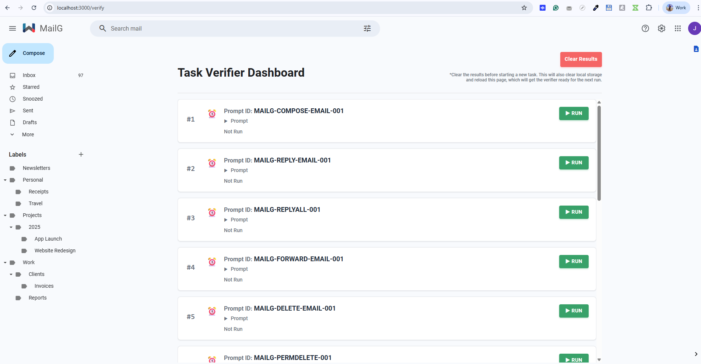
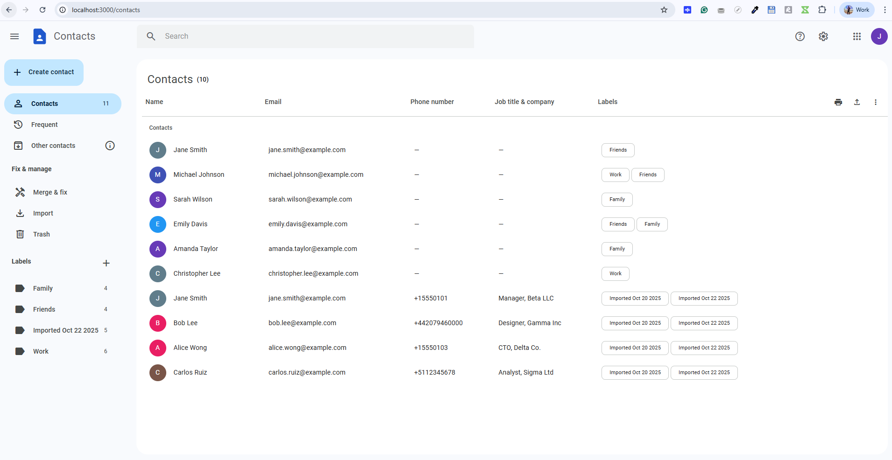
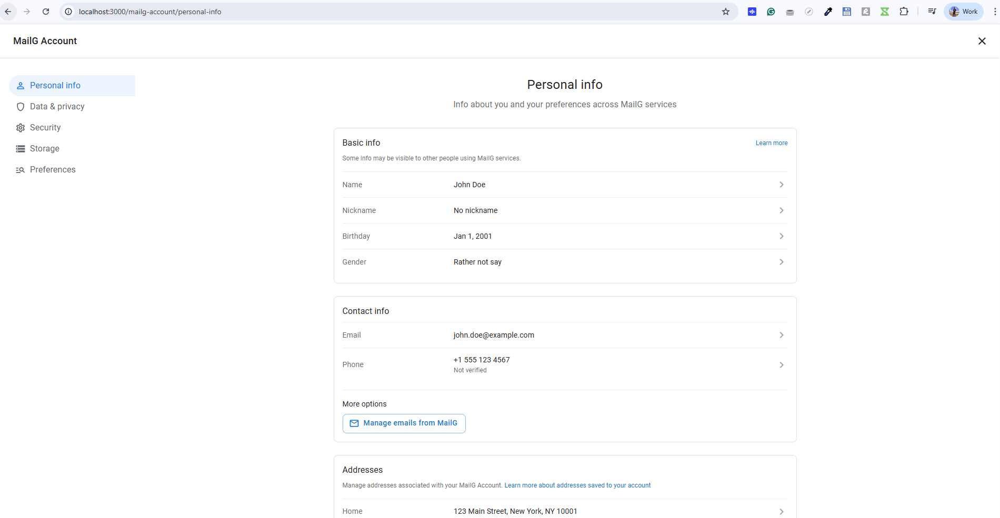

# MailG

MailG is an RL‑Gym designed to test and train AI models on mail and messaging workflows.

### Prerequisites

- Node.js (v16 or higher)
- npm

### Installation

1. Clone the repository:

```bash
git clone https://github.com/turing-rlgym/mailg.git
cd mailg
```

2. Install dependencies:

```bash
npm install
```

3. Start the development server:

```bash
npm run dev
```

### Scripts
- `npm run dev` – start Vite dev server
- `npm run build` – production build
- `npm run preview` – preview built app
- `npm run lint` – run ESLint on `src/`

---

Build and run:

```sh
docker build -t mailg .
docker run -p 3000:3000 mailg
```

Open `http://localhost:3000`.

---

## Verifiers

Verifiers check whether a particular scenario was correctly executed in the RL-Gym. The available scenarios are listed in the [Prompts](#prompts) section. To verify a task, first execute the required steps from the prompt, then use an appropriate verifier method.



### Manual Verifier

MailG provides a manual verification interface at **http://localhost:3000/verify**.

The verification dashboard displays all available test scenarios with the following features:

- **Task List**: Shows all prompts defined in `src/data/tasks.json` with their IDs and descriptions
- **Run Button**: Execute verification for each individual task
- **Status Indicators**: 
  - ⏰ Not Run (gray)
  - ✅ Passed (green)
  - ❌ Failed (red)
  - ⏳ Running (animated)
- **Collapsible Sections**: 
  - **Prompt**: View the full task description/instructions
  - **Diff Results**: See detailed comparison of expected vs actual localStorage state
- **Execution Time**: Displays how long each verification took in milliseconds
- **Clear Results**: Reset all test results and clear localStorage to prepare for a new run

#### How to Use the Verification Dashboard

1. **Navigate to the verify page**: Open `http://localhost:3000/verify` in your browser
2. **Review available tasks**: Scroll through the list to see all available verification scenarios
3. **Execute a task**: 
   - Expand the prompt section to read the task instructions
   - Perform the required actions in the main MailG interface (e.g., compose an email, apply a label, etc.)
   - Return to the verification dashboard
   - Click the "▶ Run" button for that specific task
4. **View results**:
   - The status will change to ✅ Passed or ❌ Failed
   - For failed tests, expand the "Diff Results" section to see exactly what differs between expected and actual state
   - Each localStorage key is compared individually with a visual diff viewer
5. **Clear and restart**: Click "Clear Results" to reset localStorage and prepare for the next test run

#### Example Workflow

For example, to verify the prompt `MAILG-COMPOSE-EMAIL-001`:

1. Go to `http://localhost:3000/verify`
2. Find task #1: `MAILG-COMPOSE-EMAIL-001`
3. Expand the prompt to read: "Compose a new email addressed to david.kim@acelogistics.com, cc: sarah.johnson@northwindretail.com, bcc: compliance@company.com. Subject should be 'Q3 Financial Forecast Submission'..."
4. Return to the main inbox (`http://localhost:3000/inbox`)
5. Click "Compose" and fill in all the required fields exactly as specified
6. Click "Send"
7. Return to `http://localhost:3000/verify`
8. Click "▶ Run" next to `MAILG-COMPOSE-EMAIL-001`
9. View the result: ✅ Passed (if done correctly) or ❌ Failed with diff details

### Programmatic Verifiers

#### 1. Local Browser Verification

You can run a verification directly in the browser by calling the exposed global method:

```javascript
window.verify(promptId);
```

Replace `promptId` with the appropriate prompt identifier, such as `'MAILG-COMPOSE-EMAIL-001'`. This method is useful for quick checks while interacting with the UI during development or debugging.

#### 2. API Verification (Future Enhancement)

To verify tasks through an API, you would use a **`run_id`** — a unique string that you generate when starting the RL-Gym. This `run_id` would be included in the URL when launching the gym instance, for example:

```text
http://localhost:3000?run_id={your_unique_run_id}
```

Each `run_id` would identify a single execution run, allowing you to:

* Run multiple tests **in parallel** against the same instance without conflicts
* Check verification results asynchronously, even after execution is complete

*Note: API verification endpoints are planned for future implementation.*

---

## Contacts Management

MailG includes a comprehensive contact management system accessible at **http://localhost:3000/contacts**.



### Features

- **Contact List**: Searchable table view with all contacts including name, email, phone, job title, company, and labels
- **Contact Labels**: Organize contacts into custom groups (Family, Work, Friends, Coworkers, etc.)
- **CRUD Operations**: Create, edit, and delete contacts with full form validation
- **Bulk Actions**: 
  - Select multiple contacts for batch operations
  - Delete multiple contacts at once
  - Apply labels to multiple contacts
  - Export selected contacts
- **Import/Export**: 
  - Import contacts from CSV or vCard files
  - Export contacts to CSV or vCard format
  - Automatic label creation for imported batches (e.g., "Imported Oct 22 2025")
- **Hide/Unhide Contacts**: 
  - Hide contacts from your main list while preserving them in labels
  - Easily restore hidden contacts with one click
  - Visual indicators for hidden contacts in label views
- **Contact Search**: Quick search across all contact fields
- **Favorites**: Star important contacts for quick access
- **Right Sidebar Integration**: Quick contact lookup while viewing emails

### Contact Data Structure

Contacts are stored in the `recipients` localStorage key with the following structure:

```javascript
{
  "id": "unique-contact-id",
  "name": "Jane Smith",
  "email": "jane.smith@example.com",
  "phones": [
    {
      "dialCode": "+1",
      "value": "5551234567",
      "type": "mobile"
    }
  ],
  "jobTitle": "Product Manager",
  "company": "Acme Corp",
  "labels": ["Work", "Coworkers"],
  "isFavorite": true,
  "isSaved": true,
  "notes": "Key stakeholder for Project Phoenix"
}
```

### Contact Labels

Contact labels are managed separately in the `recipientLabels` localStorage key:

```javascript
{
  "id": "label-id",
  "label": "Work",
  "color": "#039be5"
}
```

---

## MailG Account

MailG provides a comprehensive account management interface accessible at **http://localhost:3000/mailg-account/**.



### Account Sections

#### Personal Info (`/mailg-account/personal-info`)

Manage your personal information and profile settings:

- **Basic Info**:
  - Name and nickname
  - Birthday with privacy controls
  - Gender identity
- **Contact Info**:
  - Email addresses (primary and aliases)
  - Phone number with verification status
- **Addresses**:
  - Home and work addresses
  - Address management and editing

**Storage Key**: `mailGAccountPersonalInfo`

```javascript
{
  "name": "John Doe",
  "nickname": "",
  "birthday": {
    "month": "January",
    "day": "1",
    "year": "2001",
    "visibility": "private"
  },
  "gender": "Rather not say",
  "emails": ["john.doe@example.com"],
  "phone": {
    "number": "+1 555 123 4567",
    "verified": false
  },
  "addresses": {
    "home": "123 Main Street, New York, NY 10001",
    "work": ""
  }
}
```

#### Data & Privacy (`/mailg-account/data-privacy`)

Control your data collection and privacy preferences:

- **Web & App Activity**:
  - Enable/disable activity tracking
  - Include web history, voice audio, visual search
  - Auto-delete activity after 3, 18, or 36 months
- **Location History**:
  - Track location history
  - Share location edits
- **YouTube History**:
  - Track watch and search history
- **Ad Personalization**:
  - Personalize ads based on activity
  - Control ad targeting preferences
- **Search Personalization**:
  - Improve search results based on activity

**Storage Key**: `mailGAccountDataPrivacy`

```javascript
{
  "webActivityEnabled": true,
  "webActivitySubsettings": {
    "includeWebHistory": true,
    "includeVoiceAudio": false,
    "includeVisualSearch": false
  },
  "webActivityAutoDelete": "18m",
  "locationHistoryEnabled": false,
  "youtubeHistoryEnabled": true,
  "adPersonalizationEnabled": true,
  "searchPersonalizationEnabled": true,
  "autoDeleteActivity": "18m"
}
```

#### Security (`/mailg-account/security`)

Manage account security settings (UI placeholder for future implementation):

- Password management
- Two-factor authentication
- Recent security activity
- Connected devices
- Security checkup

#### Storage (`/mailg-account/storage`)

View and manage storage usage (UI placeholder for future implementation):

- Email storage breakdown
- Attachment storage
- Contact storage
- Storage cleanup tools

#### Preferences (`/mailg-account/preferences`)

Configure account-wide preferences (UI placeholder for future implementation):

- Language and region
- Accessibility settings
- Notification preferences
- Default apps

---

## State Management

The RL-Gym uses the browser's **`localStorage`** to track changes during each execution. Actions like composing emails, applying labels, moving messages, or updating settings are recorded in `localStorage`, and this state is compared against expected results to determine whether a task has passed or failed.

Because verification depends on detecting state changes, it's important that each run starts with a **clean `localStorage`**. This ensures the verifier only sees changes made during the current run.

---

### Reset State

Each execution must begin with a fresh state to avoid interference from previous runs. You can reset the state in several ways:

1. **Clear Results Button**: On the verification dashboard (`http://localhost:3000/verify`), click "Clear Results" to reset localStorage and reload the page
2. **Manual Browser Reset**: Clear localStorage from your browser's DevTools (Application → Local Storage → Clear All)
3. **Programmatic Reset**: Call the exposed global method in the browser console:

```javascript
window.reset()
```

4. **Quick Console Reset** (for RL runs):
```javascript
localStorage.clear();
indexedDB.deleteDatabase('my-database');
location.reload();
```

---

### Seed Data

All seed data lives in the `/src/contexts/fixtures/` directory. These JavaScript files define the initial dataset for the application and act as the baseline for verification.

#### Directory Structure and File Descriptions

```sh
/src/contexts/fixtures
  ├── emails.js       # Initial email messages (inbox, sent, drafts, etc.)
  ├── labels.js       # System and custom labels with colors
  ├── me.js           # Logged-in user profile (John Doe)
  ├── recipients.js   # Known contacts/recipients for autocomplete
  └── recipientLabels.js  # Contact label taxonomy
```

**File Details:**

- **emails.js** – The master list of all email messages in the system, including threads, attachments, timestamps, labels, etc.
- **labels.js** – System labels (Inbox, Sent, Drafts, Trash, Spam, Starred) and custom user-created labels with colors
- **me.js** – Data for the **currently logged-in user** (name: "John Doe", email: "john.doe@example.com")
- **recipients.js** – All known contacts for email autocomplete and recipient management
- **recipientLabels.js** – Contact labels/groups for organizing recipients

👉 **How to Add Seed Data**

If you need to add new seed data:

1. Check the structure of existing entries and make sure your new entry includes all required fields with valid values
2. A simpler method is to interact with the site (e.g., compose an email, create a label in the UI), copy the new data from **localStorage**, and then add it into the appropriate seed file (e.g., `emails.js`)

---

### Data Storage

Here are the main localStorage keys used during execution and their default/empty values:

#### Core Email & User Data

| Key | Description | Default Value |
| --- | --- | --- |
| **loggedInUser** | Current signed-in user (name, email) | `{ "name": "John Doe", "email": "john.doe@example.com" }` |
| **emails** | All email messages in the system | `[]` (populated from fixtures on first load) |
| **recipients** | Known contacts/recipients for autocomplete | `[]` (populated from fixtures on first load) |
| **recipientLabels** | Recipient labels taxonomy | `{}` (populated from fixtures on first load) |
| **deletedRecipients** | Deleted contacts stash | `[]` |
| **labels** | Label metadata (name, color, system flag) | `{}` (populated from fixtures on first load) |

#### UI State & Navigation

| Key | Description | Default Value |
| --- | --- | --- |
| **currentView** | Last active view (e.g. `inbox`, `sent`) | `"inbox"` |
| **selectedEmails** | Selected message IDs | `[]` |
| **sortOrder** | Sort preference for email list | `"newest"` |
| **currentPage** | Pagination – current page number | `1` |
| **itemsPerPage** | Pagination – items per page | `25` |
| **panelState** | Split-pane preview state | `{ "showPanel": false, "direction": "vertical" }` |
| **showQuickSettings** | Quick settings drawer state | `false` |
| **density** | Row density in email list | `"default"` (options: `default`, `compact`, `comfortable`) |
| **threading** | Conversation view on/off | `true` |
| **inboxType** | Inbox type preference | `"default"` (options: `default`, `important`, `unread`, `starred`, `priority`) |
| **isLeftSidebarExpanded** | Left sidebar expanded/collapsed | `true` |
| **rightSidebarExpanded** | Right sidebar open/closed | `true` |
| **rightSidebarActiveTab** | Right sidebar active tab state | `{ "contact": { "screen": "CONTACTS" }, "activeTab": null }` |


#### Settings Tabs State

##### General Settings (`settingsGeneral`)

Comprehensive general preferences stored as a single object:

```json
{
  "language": "en",
  "enableInputTools": false,
  "rtlSupport": false,
  "maxPageSize": 50,
  "undoSendDelay": 30,
  "defaultReplyBehavior": "reply",
  "hoverActions": true,
  "sendAndArchive": true,
  "defaultTextStyle": {
    "fontFamily": "Sans Serif",
    "fontSize": "Normal"
  },
  "images": "ask",
  "dynamicEmail": true,
  "grammar": true,
  "spelling": true,
  "autoCorrect": true,
  "smartCompose": true,
  "smartComposePersonalization": true,
  "conversationView": true,
  "nudges": {
    "suggestReplies": true,
    "suggestFollowUps": true
  },
  "smartReply": true,
  "smartFeatures": true,
  "workspaceSmartFeatures": true,
  "packageTracking": true,
  "stars": ["star", "info", "question", "exclamation", "star_outline"],
  "keyboardShortcuts": true,
  "buttonLabels": "text",
  "showMyPicture": true,
  "autoCompleteContacts": true,
  "adsImportanceSignals": true,
  "personalLevelIndicators": true,
  "snippets": true
}
```

**Key fields:**
- `language`: UI language code
- `maxPageSize`: Number of emails per page (25, 50, 100)
- `undoSendDelay`: Seconds to allow undo after sending (5, 10, 20, 30)
- `defaultReplyBehavior`: `"reply"` or `"replyAll"`
- `hoverActions`: Show quick actions on email row hover
- `sendAndArchive`: Enable "Send & Archive" button
- `defaultTextStyle`: Font family and size for compose
- `images`: External image policy (`"ask"`, `"always"`, `"never"`)
- `smartCompose`: AI-powered compose suggestions
- `conversationView`: Thread emails by subject
- `nudges`: Suggest replies/follow-ups
- `stars`: Available star types for marking emails
- `keyboardShortcuts`: Enable keyboard shortcuts
- `buttonLabels`: Show text labels on buttons (`"text"`, `"icons"`)

##### Advanced Settings (`settingsAdvanced`)

```json
{
  "autoAdvance": false,
  "templates": false,
  "customKeyboardShortcuts": false,
  "unreadMessageIcon": false
}
```

**Key fields:**
- `autoAdvance`: Automatically advance to next email after action
- `templates`: Enable email templates feature
- `customKeyboardShortcuts`: Allow custom shortcut configuration
- `unreadMessageIcon`: Show unread count in browser tab/icon

##### Labels Settings (`settingsLabels`)

```json
{
  "systemLabels": {
    "inbox": { "show": true, "showUnread": true },
    "starred": { "show": true, "showUnread": false },
    "snoozed": { "show": true, "showUnread": false },
    "sent": { "show": true, "showUnread": false },
    "drafts": { "show": true, "showUnread": false },
    "spam": { "show": false, "showUnread": false },
    "trash": { "show": false, "showUnread": false },
    "important": { "show": true, "showUnread": false }
  },
  "categories": {
    "social": true,
    "promotions": true,
    "updates": true,
    "forums": true
  },
  "customLabels": []
}
```

**Key fields:**
- `systemLabels`: Visibility settings for each system label
  - `show`: Display label in sidebar
  - `showUnread`: Show unread count next to label
- `categories`: Enable/disable inbox categories
- `customLabels`: User-created labels (managed separately in `labels` key)

##### Inbox Settings (`settingsInbox`)

```json
{
  "inboxType": "default",
  "inboxSections": [],
  "categoriesEnabled": {
    "primary": true,
    "social": false,
    "promotions": false,
    "updates": false,
    "forums": false
  },
  "readingPane": "no_split",
  "importanceMarkers": "show",
  "maxPageSize": 50
}
```

**Key fields:**
- `inboxType`: Inbox organization type
  - `"default"`: Standard chronological
  - `"important"`: Important emails first
  - `"unread"`: Unread emails first
  - `"starred"`: Starred emails first
  - `"priority"`: Priority inbox with sections
- `inboxSections`: Custom sections for priority inbox
- `categoriesEnabled`: Which category tabs to show
- `readingPane`: Preview pane location
  - `"no_split"`: No preview pane
  - `"right_of_inbox"`: Preview on right
  - `"below_inbox"`: Preview below list
- `importanceMarkers`: Show/hide importance indicators
- `maxPageSize`: Emails per page in inbox

##### Chat & Meet Settings (`settingsChat`)

```json
{
  "chatEnabled": false,
  "meetEnabled": false
}
```

**Key fields:**
- `chatEnabled`: Enable integrated chat feature (UI placeholder)
- `meetEnabled`: Enable video meeting integration (UI placeholder)

##### Filters Settings (`settingsFilters`)

```json
{
  "filters": [],
  "blockedAddresses": []
}
```

**Key fields:**
- `filters`: Array of email filter rules (conditions + actions)
- `blockedAddresses`: List of blocked sender email addresses

##### Forwarding & POP/IMAP Settings (`settingsForwarding`)

```json
{
  "forwardingEnabled": false,
  "forwardingAddress": "",
  "forwardingAction": "keep",
  "popEnabled": false,
  "popAction": "keep",
  "imapEnabled": true,
  "imapAutoExpunge": false,
  "imapDeleteAction": "archive"
}
```

**Key fields:**
- `forwardingEnabled`: Auto-forward emails to another address
- `forwardingAddress`: Destination email for forwarding
- `forwardingAction`: What to do with original (`"keep"`, `"archive"`, `"delete"`)
- `popEnabled`: Enable POP3 access
- `popAction`: POP download behavior
- `imapEnabled`: Enable IMAP access
- `imapAutoExpunge`: Automatically expunge deleted messages
- `imapDeleteAction`: What happens when IMAP client deletes (`"archive"`, `"trash"`, `"delete"`)

##### Offline Settings (`settingsOffline`)

```json
{
  "offlineEnabled": false,
  "offlineDays": 30
}
```

**Key fields:**
- `offlineEnabled`: Enable offline mail access (UI placeholder)
- `offlineDays`: Number of days of mail to sync for offline (7, 30, 90)

##### Themes Settings (`settingsThemes`)

```json
{
  "currentTheme": "default"
}
```

**Key fields:**
- `currentTheme`: Active theme name (`"default"`, `"dark"`, `"light"`, custom theme IDs)

#### MailG Account Settings

##### Personal Info (`mailGAccountPersonalInfo`)

```json
{
  "name": "John Doe",
  "nickname": "",
  "birthday": {
    "month": "January",
    "day": "1",
    "year": "2001",
    "visibility": "private"
  },
  "gender": "Rather not say",
  "emails": ["john.doe@example.com"],
  "phone": {
    "number": "+1 555 123 4567",
    "verified": false
  },
  "addresses": {
    "home": "",
    "work": ""
  }
}
```

**Key fields:**
- `name`: User's full name
- `nickname`: Optional display nickname
- `birthday`: Birth date with privacy setting (`"private"` or `"public"`)
- `gender`: Gender identity
- `emails`: Array of associated email addresses
- `phone`: Phone number and verification status
- `addresses`: Home and work addresses

##### Data & Privacy (`mailGAccountDataPrivacy`)

```json
{
  "webActivityEnabled": true,
  "webActivitySubsettings": {
    "includeWebHistory": true,
    "includeVoiceAudio": false,
    "includeVisualSearch": false
  },
  "webActivityAutoDelete": "18m",
  "locationHistoryEnabled": false,
  "locationHistorySubsettings": {
    "shareEdits": true
  },
  "youtubeHistoryEnabled": true,
  "adPersonalizationEnabled": true,
  "searchPersonalizationEnabled": true,
  "autoDeleteActivity": "18m"
}
```

**Key fields:**
- `webActivityEnabled`: Track web and app activity
- `webActivitySubsettings`: Granular activity tracking options
  - `includeWebHistory`: Save browsing history
  - `includeVoiceAudio`: Save voice recordings
  - `includeVisualSearch`: Save visual search queries
- `webActivityAutoDelete`: Auto-delete activity after period (`"3m"`, `"18m"`, `"36m"`, `"never"`)
- `locationHistoryEnabled`: Track location history
- `youtubeHistoryEnabled`: Track YouTube watch history
- `adPersonalizationEnabled`: Personalize ads based on activity
- `searchPersonalizationEnabled`: Personalize search results
- `autoDeleteActivity`: Global auto-delete setting for all activity

#### IndexedDB Stores

In addition to localStorage, MailG uses IndexedDB for large binary assets:

| Store Name | Description | Key Path | Indexes |
| --- | --- | --- | --- |
| **attachments** | File attachments (blobs, metadata) | `id` | `name` |
| **embeddedImages** | Inline images in email bodies | `id` | `emailId` |

**Usage:**
- `attachments`: Stores file attachments with their binary data, name, size, and type
- `embeddedImages`: Stores inline images referenced in email HTML bodies via `cid:` URLs

#### Summary: Complete localStorage Keys List

For quick reference, here's the complete list of all localStorage keys used by MailG:

**Core Data (6 keys):**
- `loggedInUser`, `emails`, `recipients`, `recipientLabels`, `deletedRecipients`, `labels`

**UI State (11 keys):**
- `currentView`, `selectedEmails`, `sortOrder`, `currentPage`, `itemsPerPage`, `panelState`, `showQuickSettings`, `density`, `threading`, `inboxType`, `isLeftSidebarExpanded`, `rightSidebarExpanded`, `rightSidebarActiveTab`

**Email Features (3 keys):**
- `sendAsSettings`, `signatures`, `vacationResponder`

**Notifications & Privacy (3 keys):**
- `notificationSettings`, `mailg-notification-settings`, `privacySettings`

**Settings Tabs (9 keys):**
- `settingsGeneral`, `settingsAdvanced`, `settingsLabels`, `settingsInbox`, `settingsChat`, `settingsFilters`, `settingsForwarding`, `settingsOffline`, `settingsThemes`

**Account Settings (2 keys):**
- `mailGAccountPersonalInfo`, `mailGAccountDataPrivacy`

**Total: 34 localStorage keys** + 2 IndexedDB stores

---

### How Verification Works

- Each task's expected outcome is defined in **`src/data/tasks.json`**
- Running a task updates the **relevant localStorage keys** (e.g., composing an email modifies `emails`)
- The verifier compares the **current localStorage state** with the **expected results** in `tasks.json`
- If they match → ✅ task passes. If not → ❌ task fails with a detailed diff view
- The diff viewer shows line-by-line changes between expected and actual JSON state

⚠️ **Note:** Certain fields (timestamps, IDs, session metadata, etc.) may be normalized during verification since they vary between runs and don't affect correctness.

---

## Prompts

Below are the available verification scenarios. Each prompt ID corresponds to a task in `src/data/tasks.json`.

### Email Composition & Sending

- **MAILG-COMPOSE-EMAIL-001**
  - Compose a new email addressed to david.kim@acelogistics.com, cc: sarah.johnson@northwindretail.com, bcc: compliance@company.com. Subject should be 'Q3 Financial Forecast Submission'. The message body: 'Hi David, please find attached the updated Q3 financial forecast. We've incorporated the recent adjustments in marketing spend and logistics costs. Kindly review and confirm if these align with your records. Best, Laura'. Send it immediately.

- **MAILG-REPLY-EMAIL-001**
  - Open the email from emma.brown@techstream.com with subject 'Invoice mismatch - URGENT'. Reply directly to her with the message: 'Hi Emma, thank you for flagging this. Our finance team has identified the issue and a corrected invoice has been generated. You should receive it today by 5 PM UTC. Apologies for the inconvenience.' Keep the recipient only as Emma.

- **MAILG-REPLYALL-001**
  - In the thread 'System downtime - urgent follow up' from john.smith@northwind.com (cc includes devops@company.com and support@company.com), use Reply All. Message: 'Thank you all for the detailed logs. Engineering confirmed a faulty load balancer configuration. A fix is rolling out within the next hour, and we will monitor closely.'

- **MAILG-FORWARD-EMAIL-001**
  - Find the email from jane.smith@northwindretail.com with subject 'Contract renewal signed copy'. Forward it to legal@company.com. Add this note above the original thread: 'Legal team - please archive this renewal copy for compliance records.' Ensure the PDF attachment is included.

### Email Management

- **MAILG-DELETE-EMAIL-001**
  - Delete the promotional email from deals@randomstore.com with subject 'Limited time 90% off on electronics'. Move it to Trash without opening the message.

- **MAILG-PERMDELETE-001**
  - In Trash, locate all messages from newsletter@junkads.com, including the one titled 'Daily Coupon Blast - September 2025'. Permanently delete them so they cannot be recovered.

- **MAILG-MOVE-LABEL-001**
  - Take the email from alex.green@northwindretail.com with subject 'Project Phoenix Kickoff Notes'. Move it from Inbox to the label 'Projects/Phoenix'. Keep the email in All Mail as well.

- **MAILG-STAR-UNSTAR-001**
  - Star the email from logistics.manager@acelogistics.com with subject 'Tracking update for Order #56789'. Remove the star from the thread 'Weekly HR Digest - September Week 2'.

- **MAILG-ARCHIVE-EMAIL-001**
  - Archive the thread 'Completed design mockups - Project Nova' sent by design.team@northwind.com. It should no longer appear in Inbox but remain accessible in All Mail.

- **MAILG-RESTORE-ARCHIVE-001**
  - From All Mail, locate 'Customer signed NDA - Acme Corp' and move it back into Inbox so it is visible in the main view.

### Draft Management

- **MAILG-UNDO-SEND-001**
  - After sending an email draft to thomas.wu@northwind.com with subject 'Access credentials - do not share', quickly click Undo Send within the allowed time so the recipient does not receive it.

- **MAILG-DRAFT-MANAGE-001**
  - Save a draft addressed to jane.doe@northwindretail.com with subject 'Draft: Proposal Outline'. Body: 'Hi Jane, here are the sections I plan to include in the proposal: 1) Market Overview, 2) Budget Estimates, 3) Implementation Plan. Please add your thoughts.' Do not send, just leave it in Drafts.

- **MAILG-AUTOSAVE-001**
  - Start a new email to support@northwind.com, subject 'Test auto-save feature'. Body: 'This is to test whether MailG saves drafts automatically.' Close without sending. Confirm it appears in Drafts.

- **MAILG-RECIPIENTS-001**
  - Edit the draft to michael.lee@northwind.com, add cc: sarah.connor@company.com, add bcc: compliance@company.com, and remove tom.white@company.com from recipients before saving.

---

## Architecture Overview

### Tech stack
- React 18, React Router 6
- Vite (bundler)
- MUI (Material UI) + Emotion (styling)
- TipTap + mui-tiptap (rich text editor)
- idb (IndexedDB access)
- lunr (search index)

### Project structure (high level)
- `src/pages/` – top-level routes: Inbox/MailView, SearchResults, Settings, Contacts, etc.
- `src/components/` – UI components grouped by feature (InboxView, EmailList, ComposeEmail, SettingsTabs, QuickSettings, MailActions, etc.)
- `src/contexts/` – global app state (GlobalContext, NotificationContext) and initial fixtures
- `src/hooks/` – feature hooks (sending/scheduling email, labels, compose modal, persisted state, etc.)
- `src/utils/` – helpers: email model, search, file validation, embedded images
- `public/` – static assets (fonts, icons, images, styles)

### Data model (local)
MailG runs entirely client-side. Email data is seeded from fixtures and updated in local storage/IndexedDB to simulate real behavior.
- Email objects include: `id`, `threadId`, `from`, `to`, `cc`, `bcc`, `subject`, `body`, `preview`, `timestamp`, `labels`, `attachments`, etc.
- Thread rows are built via `utils/emails.getThreadRows()`; a row represents the last message of a thread while preserving subject from the first.
- Attachments/embedded images are stored in IndexedDB using the `idb` library (see `GlobalContext` and `utils/embeddedImages`).

### State management
- Global UI/data state lives in `src/contexts/GlobalContext.jsx` using a mix of React state and a custom `usePersistedState` hook to sync with `localStorage`.
- Notifications have their own `NotificationContext` for persisted user preferences and runtime permission state.

### Routing
- Implemented with React Router 6 (`/inbox`, `/sent`, `/trash`, `/search`, `/settings/:tab`, etc.).
- Inbox supports a preview pane (resizable) with thread details; list and preview are kept in sync.

---

## Key Features (by area)

### Inbox and Threads
- **Threaded conversations**: Emails grouped by subject and thread ID, with expandable/collapsible views
- **Status indicators**: Unread (bold), starred (⭐), important (yellow marker)
- **Inline attachments**: Preview buttons for files, with download and view options
- **Embedded images**: Inline image rendering from IndexedDB storage
- **Hover actions**: Quick access to archive, delete, mark read/unread, snooze
- **Preview pane**: Resizable split-view with horizontal/vertical layouts
- **Bulk actions**: Select multiple emails for batch operations (delete, archive, label, mark as read/unread)
- **Context menu**: Right-click for quick actions on individual emails

### Compose & Drafts
- **Multiple compose windows**: Open multiple compose dialogs simultaneously, minimizable to bottom bar
- **Rich text editing**: TipTap-powered editor with formatting toolbar
  - Bold, italic, underline, strikethrough
  - Headings, lists (ordered/unordered)
  - Links, code blocks, blockquotes
  - Tables with resizable columns
  - Text alignment and indentation
- **Recipient management**: 
  - Autocomplete from contacts
  - To, Cc, Bcc fields with chip-based UI
  - Contact picker modal with search and filtering
- **Attachments**: 
  - Drag-and-drop or file picker
  - Blocked file type detection (executables, scripts)
  - Size validation with warnings for large files
  - Attachment preview and removal
- **Embedded images**: Inline image insertion with IndexedDB persistence
- **Draft autosave**: Automatic saving every few seconds while composing
- **Scheduled send**: 
  - Pick date and time for delayed sending
  - View scheduled emails in dedicated folder
  - Cancel scheduled sends before they go out
- **Undo send**: Quick undo within 5 seconds after sending
- **Reply/Forward**: Context-aware composition with quoted text and threading

### Search
- **Full-text search**: Powered by lunr.js for fast client-side indexing
- **Advanced filters**:
  - From/To/Subject/Body fields
  - Date ranges (before/after/between)
  - Has attachment, starred, unread
  - Label/folder filtering
- **Search suggestions**: Recent searches and quick filters
- **Category tabs**: Primary, Social, Promotions, Updates (simulated categorization)
- **Search results view**: Dedicated page with filter chips and result highlighting

### Labels & Folders
- **System labels**: Inbox, Starred, Sent, Drafts, Spam, Trash, All Mail, Important
- **Custom labels**: User-created labels with customizable colors
- **Nested labels**: Hierarchical label structure (e.g., `Projects/Phoenix`)
- **Label management**:
  - Create, edit, rename, delete labels
  - Change label colors
  - Reorder labels in sidebar
- **Multi-label support**: Apply multiple labels to a single email
- **Label counts**: Real-time unread counts per label in sidebar

### Settings
Comprehensive settings interface with multiple tabs:

#### General
- Language and input tools
- Maximum page size (pagination)
- Undo send delay
- Default text style
- Keyboard shortcuts toggle
- Button labels vs icons
- Snippets (quick text)
- Signature management
- Personal level indicators
- Vacation responder

#### Labels
- Create, edit, and delete custom labels
- Show/hide labels in sidebar
- Reorder label list

#### Inbox
- Inbox type (Default, Important first, Unread first, Starred first, Priority Inbox)
- Reading pane location (No split, Right of inbox, Below inbox)
- Filtered mail settings
- Categories (Primary, Social, Promotions, Updates, Forums)

#### Accounts and Import
- **Send mail as**: Configure display name and reply-to address
  - Stored in `sendAsSettings` localStorage key
  - Editable via modal dialog
  - Persists across sessions
- Import mail and contacts (UI placeholder)
- Check mail from other accounts (UI placeholder)
- Grant access to your account (UI placeholder)

#### Filters and Blocked Addresses
- Create email filters with conditions and actions
- Block specific senders

#### Forwarding and POP/IMAP
- Auto-forwarding configuration
- POP/IMAP access settings

#### Add-ons
- Manage third-party integrations (UI placeholder)

#### Chat and Meet
- Chat settings and integrations (UI placeholder)

#### Advanced
- Auto-advance (next conversation after action)
- Send and Archive button
- Default reply behavior
- Conversation view toggle
- External images policy
- Keyboard shortcuts reference

#### Offline
- Offline mail sync settings (UI placeholder)

#### Themes
- Theme selection (Light, Dark, Custom)
- Background images

### Contacts
- **Contact list**: Searchable table view with all contacts
- **Contact details**: Name, email, phone, notes, labels
- **Contact labels**: Organize contacts into groups (Family, Work, Friends, etc.)
- **Create/Edit/Delete**: Full CRUD operations for contacts
- **Import/Export**: Bulk contact management (UI placeholder)
- **Merge duplicates**: Find and merge duplicate contact entries
- **Right sidebar integration**: Quick contact lookup while viewing emails

### Notifications
- **Desktop notifications**: Browser notification API integration
- **Notification types**: 
  - Off (no notifications)
  - New mail (all new messages)
  - Important mail only
- **Sound alerts**: Multiple sound options with preview
- **Permission management**: Request and manage browser notification permissions
- **Persistent preferences**: Settings saved to localStorage

### Right Sidebar
- **Collapsible tabs**: Calendar, Keep, Tasks, Contacts, Add-ons
- **Contacts tab**: 
  - Quick contact search
  - Recent contacts
  - Contact details popup
  - Add to email composition
- **Tasks tab**: Task list integration (UI placeholder)
- **Resizable**: Adjustable width

### Keyboard Shortcuts
- `c` - Compose new email
- `r` - Reply
- `a` - Reply all
- `f` - Forward
- `e` - Archive
- `#` - Delete
- `s` - Star/unstar
- `u` - Mark as unread
- `Shift + u` - Mark as read
- `j` / `k` - Navigate up/down in list
- `o` or `Enter` - Open email
- `Escape` - Close email/dialog
- `gi` - Go to Inbox
- `gs` - Go to Starred
- `gt` - Go to Sent
- `gd` - Go to Drafts
- `/` - Focus search box

---

## Component Architecture

### Key Components Map

```
src/
├── pages/
│   ├── MailView.jsx              # Main inbox/folder view with list + preview
│   ├── EmailDetails.jsx          # Full-page email view
│   ├── SearchResultsView.jsx     # Search results page
│   ├── Settings.jsx              # Settings page with tab navigation
│   ├── Contacts/                 # Contact management pages
│   └── VerificationDashboard.jsx # Task verification UI
│
├── components/
│   ├── Header.jsx                # Top app bar with search, settings, profile
│   ├── Layout.jsx                # Main layout wrapper
│   │
│   ├── LeftSidebar/              # Navigation sidebar
│   │   ├── index.jsx             # Compose button, folders, labels
│   │   ├── SidebarItem.jsx       # Individual folder/label item
│   │   ├── LabelItem.jsx         # Custom label with color
│   │   └── useLabelCounts.js     # Hook for unread counts
│   │
│   ├── EmailList/                # Email list table
│   │   ├── Table.jsx             # Main table with rows
│   │   ├── ContextMenu.jsx       # Right-click menu
│   │   ├── Footer.jsx            # Storage/terms footer
│   │   ├── LabelsSubMenu.jsx     # Label picker submenu
│   │   └── MoveToSubMenu.jsx     # Move to folder submenu
│   │
│   ├── InboxView/                # Email detail view
│   │   ├── index.jsx             # Main container
│   │   ├── Subject.jsx           # Subject line with actions
│   │   ├── Content.jsx           # Email body renderer
│   │   ├── ActionBar.jsx         # Top action buttons
│   │   ├── Actions.jsx           # Reply/Forward buttons
│   │   ├── MoreActions.jsx       # Additional actions dropdown
│   │   └── Attachments.jsx       # Attachment list
│   │
│   ├── ComposeEmail/             # Compose dialog
│   │   ├── ComposeEmail.jsx      # Main compose form
│   │   ├── ComposeEmailWrapper.jsx # Window management
│   │   ├── RecipientsInput.jsx   # To/Cc/Bcc fields
│   │   ├── RecipientChip.jsx     # Individual recipient chip
│   │   └── SelectContacts/       # Contact picker modal
│   │
│   ├── ComposeReply/             # Reply/Forward composition
│   │   ├── ComposeReply.jsx      # Reply form
│   │   └── ReplyContainer.jsx    # Container with quoted text
│   │
│   ├── RichTextEditor/           # TipTap editor
│   │   ├── RichTextEditor.jsx    # Main editor component
│   │   ├── Toolbar.jsx           # Formatting toolbar
│   │   └── extensions.js         # TipTap extensions config
│   │
│   ├── SearchBar/                # Search interface
│   │   ├── SearchBar.jsx         # Main search input
│   │   ├── AdvancedSearch.jsx    # Advanced filters modal
│   │   └── SearchSuggestions.jsx # Autocomplete dropdown
│   │
│   ├── SettingsTabs/             # Settings pages
│   │   ├── GeneralTab.jsx        # General settings
│   │   ├── LabelsTab.jsx         # Label management
│   │   ├── InboxTab.jsx          # Inbox configuration
│   │   ├── AccountsTab.jsx       # Accounts and Import
│   │   ├── EditEmailAddressModal.jsx # Send-as editor
│   │   └── [50+ other setting components]
│   │
│   ├── Labels/                   # Label components
│   │   ├── CreateLabelDialog.jsx # New label modal
│   │   ├── EditLabelDialog.jsx   # Edit label modal
│   │   └── EmailLabelChips.jsx   # Label chips display
│   │
│   ├── MailActions/              # Email action menus
│   │   ├── index.jsx             # Main actions dropdown
│   │   ├── Labels.jsx            # Label picker
│   │   ├── MoveToMenu.jsx        # Move to folder
│   │   ├── Snooze.jsx            # Snooze picker
│   │   └── SpamActions.jsx       # Spam/unsubscribe
│   │
│   ├── Contacts/                 # Contact components
│   │   ├── ContactsTable.jsx     # Contact list table
│   │   ├── ContactPopup.jsx      # Contact details popup
│   │   └── ManageLabelsDropdown.jsx # Contact label picker
│   │
│   ├── QuickSettings/            # Quick settings panel
│   │   ├── index.jsx             # Main panel
│   │   ├── Themes.jsx            # Theme picker
│   │   ├── Threading.jsx         # Threading toggle
│   │   └── Apps.jsx              # App integrations
│   │
│   ├── RightSidebar.jsx          # Right sidebar with tabs
│   ├── RightSidebarTabs/         # Sidebar tab content
│   ├── ToolBar/                  # Email list toolbar
│   ├── Banners/                  # Info banners (spam, trash, etc.)
│   ├── DiffView/                 # Verification diff viewer
│   └── ui/                       # Shared UI components
│
├── contexts/
│   ├── GlobalContext.jsx         # Main app state
│   ├── NotificationContext.jsx   # Notification state
│   └── fixtures/                 # Seed data
│
├── hooks/
│   ├── usePersistedState.js      # localStorage sync hook
│   ├── useSendEmail.jsx          # Email sending logic
│   ├── useScheduleEmail.jsx      # Scheduled send logic
│   ├── useDraftManagement.js     # Draft autosave
│   ├── useMailActions.js         # Email actions (archive, delete, etc.)
│   ├── useLabels.js              # Label operations
│   └── useComposeModal.js        # Compose window management
│
└── utils/
    ├── emails.js                 # Email data model & normalization
    ├── search.js                 # Search indexing & filtering
    ├── embeddedImages.js         # IndexedDB image operations
    ├── fileValidation.js         # Attachment validation
    ├── helperFunctions.js        # Utilities (diff, sorting, etc.)
    └── categories.js             # Email categorization logic
```

---

## Development Notes

### Where Things Live

**Core UI Components:**
- **List UI**: `src/components/EmailList/` - Table rows, footer, context menu, pagination
- **Thread view**: `src/components/InboxView/` - Subject bar, content renderer, action buttons
- **Compose**: `src/components/ComposeEmail/` and `src/components/ComposeReply/` - Email composition
- **Settings**: `src/components/SettingsTabs/` and `src/pages/Settings.jsx` - All settings pages
- **Contacts**: `src/components/Contacts/` and `src/pages/Contacts/` - Contact management
- **Search**: `src/components/SearchBar/` and `src/pages/SearchResultsView.jsx` - Search UI

**State Management:**
- **Global state**: `src/contexts/GlobalContext.jsx` - Main app state with persistence
- **Notifications**: `src/contexts/NotificationContext.jsx` - Notification preferences
- **Persistence hook**: `src/hooks/usePersistedState.js` - localStorage sync utility
- **Seed data**: `src/contexts/fixtures/` - Initial email/contact/label data

**Data & Logic:**
- **Email model**: `src/utils/emails.js` - Email normalization, threading, sorting
- **Search engine**: `src/utils/search.js` - Lunr.js indexing and filtering
- **Attachments**: `src/utils/embeddedImages.js` - IndexedDB operations for files/images
- **Validation**: `src/utils/fileValidation.js` - File type and size validation
- **Categorization**: `src/utils/categories.js` - Email category detection

**Custom Hooks:**
- `useSendEmail.jsx` - Email sending with validation and threading
- `useScheduleEmail.jsx` - Scheduled send logic
- `useDraftManagement.js` - Auto-save drafts
- `useMailActions.js` - Archive, delete, label, move operations
- `useLabels.js` - Label CRUD operations
- `useComposeModal.js` - Multi-window compose management

### How Email Sending Works

Emails are **simulated locally** - no actual SMTP or API calls:

1. **Compose**: User fills in recipients, subject, body, attachments
2. **Validation**: Check for valid recipients, subject, blocked file types
3. **Send**: 
   - Generate new email object with unique ID and threadId
   - Add `Sent` label
   - Update `emails` array in localStorage
   - If replying/forwarding, update thread linkage
4. **Attachments**: Files stored in IndexedDB `attachments` store
5. **Embedded images**: Inline images stored in IndexedDB `embeddedImages` store
6. **Threading**: Emails with same subject (normalized) grouped by threadId

**Draft flow:**
- Auto-save every 3 seconds while composing
- Drafts stored with `Drafts` label
- Opening a draft removes it from Drafts and reopens compose window

**Scheduled send:**
- Emails stored with `Scheduled` label and `scheduledDate`/`scheduledTime`
- Visible in Scheduled folder
- Can be cancelled before send time
- *Note: Actual delayed sending is simulated; in production would require backend*

### Adding New Features

**To add a new email action:**
1. Add action handler in `src/hooks/useMailActions.js`
2. Update UI in `src/components/MailActions/` or `src/components/EmailList/ContextMenu.jsx`
3. Update localStorage state in `GlobalContext`
4. Add verification task in `src/data/tasks.json` if needed

**To add a new settings tab:**
1. Create component in `src/components/SettingsTabs/YourTab.jsx`
2. Add tab definition in `src/pages/Settings.jsx` `tabs` array
3. Map component in `tabComponents` object
4. Persist settings using `usePersistedState` hook

**To add new seed data:**
1. Edit fixture files in `src/contexts/fixtures/`
2. Follow existing data structure (IDs, timestamps, labels, etc.)
3. Or: Use the UI to create data, copy from localStorage, add to fixture

### Accessibility & Keyboard Navigation

The UI follows MUI accessibility semantics:
- Semantic HTML elements (`<button>`, `<nav>`, `<main>`)
- ARIA labels and roles where needed
- Keyboard navigation for all interactive elements
- Focus management in modals and dialogs
- Screen reader announcements for actions

**Keyboard shortcuts** are implemented in `src/components/Layout.jsx` using event listeners.

### Performance Considerations

- **Email list virtualization**: Not currently implemented; may be needed for >1000 emails
- **Search indexing**: Lunr.js indexes are built on mount; large datasets may cause delays
- **IndexedDB**: Used for large binaries to avoid localStorage size limits (typically 5-10MB)
- **React.memo**: Used selectively for expensive components (email content, diff viewer)
- **Debouncing**: Applied to search input and draft auto-save

### Browser Compatibility

Tested on:
- Chrome 90+
- Firefox 88+
- Safari 14+
- Edge 90+

**Required APIs:**
- localStorage
- IndexedDB
- Notification API (for desktop notifications)
- File API (for attachments)

---

## Testing & Verification

### Manual Testing

Use the verification dashboard at `http://localhost:3000/verify` to test scenarios:

1. Navigate to verify page
2. Read prompt instructions
3. Execute task in main UI
4. Return to verify page and click "Run"
5. Review pass/fail status and diff results

### Automated Testing (Future)

The project is set up to support automated testing:

**Planned test types:**
- **Unit tests**: Jest + React Testing Library for components
- **Integration tests**: Test email flows (compose → send → verify)
- **E2E tests**: Playwright/Cypress for full user scenarios
- **Verification tests**: Programmatic execution of tasks.json scenarios

**To add tests:**
```bash
# Install testing dependencies (not currently in package.json)
npm install --save-dev @testing-library/react @testing-library/jest-dom jest

# Create test files
# src/components/EmailList/__tests__/Table.test.jsx
# src/utils/__tests__/emails.test.js
```

### Verification Task Format

Tasks are defined in `src/data/tasks.json`:

```json
{
  "MAILG-TASK-ID-001": {
    "prompt": "Detailed instructions for the task...",
    "result": {
      "emails": "[...expected emails array as JSON string...]",
      "labels": "{...expected labels object as JSON string...}"
    }
  }
}
```

**Key points:**
- `prompt`: Human-readable task description
- `result`: Expected localStorage state after task completion
- Each key in `result` maps to a localStorage key
- Values are JSON-stringified to allow for diff comparison

---

## Troubleshooting

### Common Issues

**Port already in use**
```bash
# Stop other Vite instances or use different port
npm run dev -- --port 3001
```

**Stale local data / weird behavior**
```bash
# Clear all data and refresh
# In browser console:
localStorage.clear();
indexedDB.deleteDatabase('my-database');
location.reload();
```

**Lint errors**
```bash
npm run lint
# Fix auto-fixable issues:
npm run lint -- --fix
```

**Build fails**
```bash
# Clear node_modules and reinstall
rm -rf node_modules package-lock.json
npm install
npm run build
```

**Attachments not showing**
- Check browser console for IndexedDB errors
- Ensure `my-database` exists in Application → IndexedDB (DevTools)
- Try clearing IndexedDB and re-uploading attachments

**Search not working**
- Check if lunr index is built (console logs on mount)
- Verify `emails` array in localStorage is populated
- Try refreshing to rebuild search index

**Notifications not appearing**
- Check browser notification permissions (should be "Allow")
- Verify `notificationSettings.enabled` is `true` in localStorage
- Check browser console for Notification API errors
- Some browsers block notifications in incognito mode

**Compose window not opening**
- Check for JavaScript errors in console
- Verify `composeWindows` state in React DevTools
- Try refreshing the page

### Reset State Quickly (for RL runs)

**Method 1: Verification Dashboard**
- Go to `http://localhost:3000/verify`
- Click "Clear Results" button
- Page will reload with fresh state

**Method 2: Browser Console**
```javascript
localStorage.clear();
indexedDB.deleteDatabase('my-database');
location.reload();
```

**Method 3: DevTools Manual**
1. Open DevTools (F12)
2. Application tab → Local Storage → `http://localhost:3000` → Clear All
3. Application tab → IndexedDB → `my-database` → Delete database
4. Refresh page (F5)

### Debug Mode

Enable verbose logging:
```javascript
// In browser console
localStorage.setItem('DEBUG', 'true');
location.reload();
```

View current state:
```javascript
// Check emails
JSON.parse(localStorage.getItem('emails'));

// Check labels
JSON.parse(localStorage.getItem('labels'));

// Check all keys
Object.keys(localStorage);
```

---

## Deployment

### Production Build

```bash
npm run build
```

This creates an optimized production build in the `dist/` directory.

### Preview Production Build Locally

```bash
npm run preview
```

Opens the built app at `http://localhost:4173` (or another port if 4173 is in use).

### Deploy to Vercel

The project includes a `vercel.json` configuration file for easy deployment:

```bash
# Install Vercel CLI
npm install -g vercel

# Deploy
vercel
```

Or connect your GitHub repository to Vercel for automatic deployments on push.

### Deploy to Netlify

```bash
# Build command: npm run build
# Publish directory: dist

# Or use Netlify CLI
npm install -g netlify-cli
netlify deploy --prod
```

### Deploy to GitHub Pages

1. Update `vite.config.js` to set the base path:
```javascript
export default defineConfig({
  base: '/your-repo-name/',
  // ... rest of config
})
```

2. Build and deploy:
```bash
npm run build
npx gh-pages -d dist
```

### Environment Variables

The app runs entirely client-side and doesn't require environment variables. All configuration is done through:
- `src/contexts/fixtures/` - Seed data
- `src/data/tasks.json` - Verification tasks
- localStorage - Runtime state

