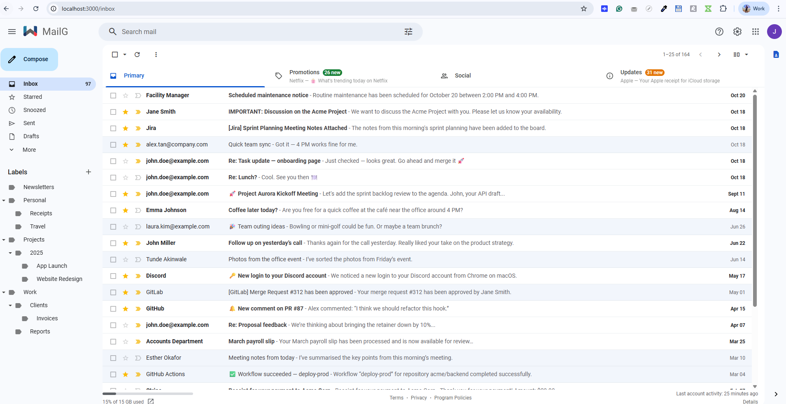
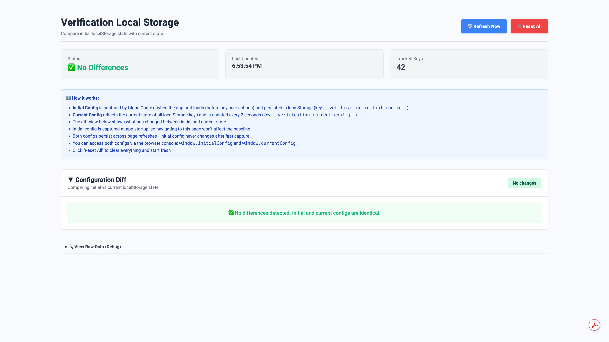

# MailG

MailG is an RL‑Gym designed to test and train AI models on mail and messaging workflows. It provides a controlled environment with end‑to‑end scenarios: composing, sending, replying/forwarding, threading, search, labels, settings, notifications, and attachments/embedded images. The UI, state, and data model simulate a modern email client while remaining fully local and deterministic.

### Highlights
- Clean, production‑quality UI with sidebars, thread preview, and split panels
- Multiple compose windows, drafts, scheduled send, attachments, inline images
- Search with filters, categories, and quick actions
- Full Settings area (General, Labels, Inbox, Accounts and Import, etc.)
- Contact management with labels, import/export, and organization features
- Local persistence of user/session/app state for accurate verification
- IndexedDB for large binaries (attachments and embedded images)

---


## Key Features

<details>

<summary><b>Email Management</b></summary>

- **Compose Email:** Create and send new email messages
- **Reply to Email:** Respond to received emails
- **Reply All:** Reply to all recipients of an email
- **Forward Email:** Forward emails to other recipients
- **Delete Email:** Move emails to trash
- **Permanently Delete:** Remove emails from trash permanently
- **Move to Folder:** Organize emails into different folders/labels
- **Mark as Read:** Mark emails as read/unread
- **Star/Unstar Email:** Add or remove star markers from emails
- **Archive Email:** Remove emails from inbox while keeping them accessible
- **Restore Archived:** Move archived emails back to inbox
- **Undo Send:** Cancel email sending within time window
- **Schedule Send:** Schedule emails to be sent at specific times
- **Draft Management:** Save, edit, and manage email drafts
- **Email Threading:** Group related emails into conversation threads
</details>

<details>

<summary><b>Email Composition</b></summary>

- **Rich Text Editor:** Format emails with fonts, colors, styles
- **Plain Text Mode:** Compose emails in plain text format
- **Insert Links:** Add hyperlinks to email content
- **Auto-Save Drafts:** Automatically save email drafts while composing
- **Recipients Management:** Add, remove, edit To, CC, BCC recipients
- **Add Attachments:** Attach files to emails
- **Remove Attachments:** Delete attached files before sending
- **Attachment Preview:** Preview attached files before sending
- **Insert Images:** Embed images directly in email body
- **Signature Management:** Add and manage email signatures
</details>

<details>

<summary><b>Inbox Management</b></summary>

- **Inbox View:** Display received emails in organized layout
- **Email List:** Show emails in list format with key information
- **Bulk Actions:** Perform actions on multiple emails simultaneously
- **Email Sorting:** Sort emails by date, sender, subject, importance
- **Refresh Inbox (Manual Version):** Manual and automatic email synchronization
- **Email Preview:** Quick preview of email content without opening
- **Conversation View:** Group related emails in threaded conversations
- **Density Settings:** Adjust email list spacing (comfortable, cozy, compact)
- **Reading Pane:** Side or bottom pane for reading emails
- **Multiple Selection:** Select multiple emails for batch operations
</details>

<details>

<summary><b>Search & Filters</b></summary>

- **Basic Search:** Search emails by keywords in subject/content
- **Search by Sender:** Find emails from specific senders
- **Search by Date:** Filter emails by date ranges
- **Advanced Search:** Search with multiple criteria and operators
- **Search Attachments:** Find emails with or without attachments
- **Search History:** Access previous search queries
- **Saved Searches:** Store frequently used search queries
- **Search Suggestions:** Auto-complete search terms and suggestions
</details>

<details>

<summary><b>User Interface</b></summary>

- **Navigation Menu:** Left sidebar with folders, labels, and features
- **Toolbar Actions:** Top toolbar with common email actions  
- **Error Messages:** User-friendly error handling and recovery
- **Keyboard Shortcuts:** Hotkeys for quick email operations
- **Responsive Design:** Optimize interface for different screen sizes
- **Context Menus:** Right-click menus for quick actions

</details>

<details>

<summary><b>Organization & Labels</b></summary>

- **Create Labels:** Set up custom labels for email organization
- **Apply Labels:** Tag emails with relevant labels
- **Remove Labels:** Untag emails from labels
- **Label Colors:** Assign colors to labels for visual organization
- **Nested Labels:** Create hierarchical label structures
- **Label Management:** Edit, rename, delete labels
- **Smart Labels:** System-generated labels (Important, Social, etc.)
- **Label Filters:** View emails by specific labels
</details>

<details>

<summary><b>Contact Management</b></summary>

- **Add Contacts:** Save email addresses to contact list
- **Edit Contacts:** Update contact information and details
- **Contact Groups:** Create and manage contact groups
- **Auto-Complete:** Suggest contacts while typing email addresses
- **Contact Import:** Import contacts from external sources
- **Contact Export:** Export contact lists
- **Contact Search:** Find contacts by name or email
</details>

<details>

<summary><b>Settings & Preferences</b></summary>

- **Account Settings:** Configure email account parameters
- **Display Settings:** Customize email display preferences
- **Signature Settings:** Create and manage multiple email signatures
- **Auto-Reply Settings:** Set up automatic reply messages
- **Privacy Settings:** Control privacy and data sharing options
- **Notification Settings:** Configure email notification preferences
</details>

<details>

<summary><b>Security & Privacy</b></summary>

- **Spam Folder:** Quarantine suspected spam messages
</details>

<details>

<summary><b>Data Management</b></summary>

- **Email Recovery:** Restore accidentally deleted emails
</details>

---

## Getting Started



### Prerequisites

- Node.js (v16 or higher)
- npm

### Installation

1. Clone the repository:

```bash
git clone https://github.com/turing-rlgym/mailg.git
cd mailg
```

2. Install dependencies:

```bash
npm install
```

3. Start the development server:

```bash
npm run dev
```

### Scripts
- `npm run dev` – start Vite dev server
- `npm run build` – production build
- `npm run preview` – preview built app
- `npm run lint` – run ESLint on `src/`

---

## Docker Setup

To run the app using Docker, follow these steps:

1. **Build the Docker image:**

```sh
docker build -t mailg .
```

2. **Run the Docker container:**

```sh
docker run -d -p 3003:80 mailg
```

3. Open your browser and navigate to localhost:3003 to see the app running.

---

## Verifiers

<details>
  <summary>
    The verifiers are still under development.
    
  Verifiers check whether a particular scenario was correctly executed in the RL-Gym. The available scenarios are listed in the [Prompts](#prompts) section. To verify a task, first execute the required steps from the prompt, then use an appropriate verifier method.
  </summary>


### Manual Verifier

MailG provides a manual verification interface at **http://localhost:3000/verify**.

The verification dashboard displays all available test scenarios with the following features:

- **Task List**: Shows all prompts defined in `src/data/tasks.json` with their IDs and descriptions
- **Run Button**: Execute verification for each individual task
- **Status Indicators**: 
  - ⏰ Not Run (gray)
  - ✅ Passed (green)
  - ❌ Failed (red)
  - ⏳ Running (animated)
- **Collapsible Sections**: 
  - **Prompt**: View the full task description/instructions
  - **Diff Results**: See detailed comparison of expected vs actual localStorage state
- **Execution Time**: Displays how long each verification took in milliseconds
- **Clear Results**: Reset all test results and clear localStorage to prepare for a new run

#### How to Use the Verification Dashboard

1. **Navigate to the verify page**: Open `http://localhost:3000/verify` in your browser
2. **Review available tasks**: Scroll through the list to see all available verification scenarios
3. **Execute a task**: 
   - Expand the prompt section to read the task instructions
   - Perform the required actions in the main MailG interface (e.g., compose an email, apply a label, etc.)
   - Return to the verification dashboard
   - Click the "▶ Run" button for that specific task
4. **View results**:
   - The status will change to ✅ Passed or ❌ Failed
   - For failed tests, expand the "Diff Results" section to see exactly what differs between expected and actual state
   - Each localStorage key is compared individually with a visual diff viewer
5. **Clear and restart**: Click "Clear Results" to reset localStorage and prepare for the next test run

#### Example Workflow

For example, to verify the prompt `MAILG-COMPOSE-EMAIL-001`:

1. Go to `http://localhost:3000/verify`
2. Find task #1: `MAILG-COMPOSE-EMAIL-001`
3. Expand the prompt to read: "Compose a new email addressed to david.kim@acelogistics.com, cc: sarah.johnson@northwindretail.com, bcc: compliance@company.com. Subject should be 'Q3 Financial Forecast Submission'..."
4. Return to the main inbox (`http://localhost:3000/inbox`)
5. Click "Compose" and fill in all the required fields exactly as specified
6. Click "Send"
7. Return to `http://localhost:3000/verify`
8. Click "▶ Run" next to `MAILG-COMPOSE-EMAIL-001`
9. View the result: ✅ Passed (if done correctly) or ❌ Failed with diff details
</details>

### LocalStorage Verification

You can verify actions performed in the browser correctly update the corresponding localStorage key(s) by visiting the `http://localhost:3000/verify-ls` route.

The UI updates in near real time as you interact with the application. A “Refresh Now” button is available to manually refresh and sync the display, and a “Reset All” button allows you to clear localStorage and reload the page.



---

## Contacts Management

MailG includes a comprehensive contact management system accessible at **http://localhost:3000/contacts**.


### Features

- **Contact List**: Searchable table view with all contacts including name, email, phone, job title, company, and labels
- **Contact Labels**: Organize contacts into custom groups (Family, Work, Friends, Coworkers, etc.)
- **CRUD Operations**: Create, edit, and delete contacts with full form validation
- **Bulk Actions**: 
  - Select multiple contacts for batch operations
  - Delete multiple contacts at once
  - Apply labels to multiple contacts
  - Export selected contacts
- **Import/Export**: 
  - Import contacts from CSV or vCard files
  - Export contacts to CSV or vCard format
  - Automatic label creation for imported batches (e.g., "Imported Oct 22 2025")
- **Hide/Unhide Contacts**: 
  - Hide contacts from your main list while preserving them in labels
  - Easily restore hidden contacts with one click
  - Visual indicators for hidden contacts in label views
- **Contact Search**: Quick search across all contact fields
- **Favorites**: Star important contacts for quick access
- **Right Sidebar Integration**: Quick contact lookup while viewing emails

---

## MailG Account

MailG provides a comprehensive account management interface accessible at **http://localhost:3000/mailg-account/**.


### Account Sections

#### Personal Info (`/mailg-account/personal-info`)

Manage your personal information and profile settings:

- **Basic Info**:
  - Name and nickname
  - Birthday with privacy controls
  - Gender identity
- **Contact Info**:
  - Email addresses (primary and aliases)
  - Phone number with verification status
- **Addresses**:
  - Home and work addresses
  - Address management and editing

**Storage Key**: `mailGAccountPersonalInfo`

#### Data & Privacy (`/mailg-account/data-privacy`)

Control your data collection and privacy preferences:

- **Web & App Activity**:
  - Enable/disable activity tracking
  - Include web history, voice audio, visual search
  - Auto-delete activity after 3, 18, or 36 months
- **Location History**:
  - Track location history
  - Share location edits
- **YouTube History**:
  - Track watch and search history
- **Ad Personalization**:
  - Personalize ads based on activity
  - Control ad targeting preferences
- **Search Personalization**:
  - Improve search results based on activity

#### Security (`/mailg-account/security`)

Manage account security settings (UI placeholder for future implementation):

- Password management
- Two-factor authentication
- Recent security activity
- Connected devices
- Security checkup

#### Storage (`/mailg-account/storage`)

View and manage storage usage (UI placeholder for future implementation):

- Email storage breakdown
- Attachment storage
- Contact storage
- Storage cleanup tools

#### Preferences (`/mailg-account/preferences`)

Configure account-wide preferences (UI placeholder for future implementation):

- Language and region
- Accessibility settings
- Notification preferences
- Default apps

---

## State Management

The RL-Gym uses the browser's **`localStorage`** to track changes during each execution. Actions like composing emails, applying labels, moving messages, or updating settings are recorded in `localStorage`, and this state is compared against expected results to determine whether a task has passed or failed.

Because verification depends on detecting state changes, it's important that each run starts with a **clean `localStorage`**. This ensures the verifier only sees changes made during the current run.

---

### Reset State

Each execution must begin with a fresh state to avoid interference from previous runs. You can reset the state in several ways:

1. **Clear Results Button**: On the verification dashboard (`http://localhost:3000/verify`), click "Clear Results" to reset localStorage and reload the page
2. **Manual Browser Reset**: Clear localStorage from your browser's DevTools (Application → Local Storage → Clear All)
3. **Programmatic Reset**: Call the exposed global method in the browser console:

```javascript
localStorage.clear();
indexedDB.deleteDatabase('my-database');
location.reload();
```

---

### Seed Data

All seed data lives in the `/src/contexts/fixtures/` directory. These JavaScript files define the initial dataset for the application and act as the baseline for verification.

#### Directory Structure and File Descriptions

```sh
/src/contexts/fixtures
  ├── emails.js       # Initial email messages (inbox, sent, drafts, etc.)
  ├── labels.js       # System and custom labels with colors
  ├── me.js           # Logged-in user profile (John Doe)
  ├── recipients.js   # Known contacts/recipients for autocomplete
  └── recipientLabels.js  # Contact label taxonomy
```

**File Details:**

- **emails.js** – The master list of all email messages in the system, including threads, attachments, timestamps, labels, etc.
- **labels.js** – System labels (Inbox, Sent, Drafts, Trash, Spam, Starred) and custom user-created labels with colors
- **me.js** – Data for the **currently logged-in user** (name: "John Doe", email: "john.doe@example.com")
- **recipients.js** – All known contacts for email autocomplete and recipient management
- **recipientLabels.js** – Contact labels/groups for organizing recipients

👉 **How to Add Seed Data**

If you need to add new seed data:

1. Check the structure of existing entries and make sure your new entry includes all required fields with valid values
2. A simpler method is to interact with the site (e.g., compose an email, create a label in the UI), copy the new data from **localStorage**, and then add it into the appropriate seed file (e.g., `emails.js`)

---

### Data Storage

Here are the main localStorage keys used during execution and their default/empty values:

#### Core Email & User Data

| Key                   | Description                                | Default Value                                             |
| --------------------- | ------------------------------------------ | --------------------------------------------------------- |
| **loggedInUser**      | Current signed-in user (name, email)       | `{ "name": "John Doe", "email": "john.doe@example.com" }` |
| **emails**            | All email messages in the system           | `[]` (populated from fixtures on first load)              |
| **recipients**        | Known contacts/recipients for autocomplete | `[]` (populated from fixtures on first load)              |
| **recipientLabels**   | Recipient labels taxonomy                  | `{}` (populated from fixtures on first load)              |
| **deletedRecipients** | Deleted contacts stash                     | `[]`                                                      |
| **hiddenRecipients**  | Hidden/archived contacts (not shown in UI) | `[]`                                                      |
| **labels**            | Label metadata (name, color, system flag)  | `{}` (populated from fixtures on first load)              |
| **searchIndex**       | Full-text search index for email content   | `null` (built dynamically from emails)                    |

#### UI State & Navigation

| Key                       | Description                             | Default Value                                                                  |
| ------------------------- | --------------------------------------- | ------------------------------------------------------------------------------ |
| **currentView**           | Last active view (e.g. `inbox`, `sent`) | `"inbox"`                                                                      |
| **selectedEmails**        | Selected message IDs                    | `[]`                                                                           |
| **sortOrder**             | Sort preference for email list          | `"newest"`                                                                     |
| **currentPage**           | Pagination – current page number        | `1`                                                                            |
| **itemsPerPage**          | Pagination – items per page             | `25`                                                                           |
| **panelState**            | Split-pane preview state                | `{ "showPanel": false, "direction": "vertical" }`                              |
| **showQuickSettings**     | Quick settings drawer state             | `false`                                                                        |
| **density**               | Row density in email list               | `"default"` (options: `default`, `compact`, `comfortable`)                     |
| **threading**             | Conversation view on/off                | `true`                                                                         |
| **inboxType**             | Inbox type preference                   | `"default"` (options: `default`, `important`, `unread`, `starred`, `priority`) |
| **isLeftSidebarExpanded** | Left sidebar expanded/collapsed         | `true`                                                                         |
| **rightSidebarExpanded**  | Right sidebar open/closed               | `true`                                                                         |
| **rightSidebarActiveTab** | Right sidebar active tab state          | `{ "contact": { "screen": "CONTACTS" }, "activeTab": null }`                   |

#### Email Features

| Key                   | Description                              | Default Value                                                                                                     |
| --------------------- | ---------------------------------------- | ----------------------------------------------------------------------------------------------------------------- |
| **sendAsSettings**    | "Send mail as" display name and reply-to | `{ "displayName": "John Doe", "email": "john.doe@example.com", "replyTo": "" }`                                   |
| **signatures**        | Email signatures configuration           | `{ "list": [], "useForNewEmails": "", "useForRepliesAndForwards": "", "insertSignatureBeforeQuotedText": false }` |
| **vacationResponder** | Vacation autoresponder settings          | `{ "enabled": false, "firstDay": "", "lastDay": "", "subject": "", "message": "", "onlyContacts": false }`        |

#### Notifications & Privacy

| Key                             | Description                                    | Default Value                                                                                                                     |
| ------------------------------- | ---------------------------------------------- | --------------------------------------------------------------------------------------------------------------------------------- |
| **notificationSettings**        | Notification preferences (GlobalContext)       | `{ "type": "off", "sound": "1", "enabled": false }`                                                                               |
| **mailg-notification-settings** | Notification preferences (NotificationContext) | `{ "type": "off", "sound": "1", "enabled": false }`                                                                               |
| **privacySettings**             | Privacy and data collection settings           | `{ "analyticsEnabled": false, "crashReportsEnabled": false, "personalizationEnabled": false, "adsPersonalizationEnabled": true }` |
`

#### IndexedDB Stores

In addition to localStorage, MailG uses IndexedDB for large binary assets:

| Store Name         | Description                        | Key Path | Indexes   |
| ------------------ | ---------------------------------- | -------- | --------- |
| **attachments**    | File attachments (blobs, metadata) | `id`     | `name`    |
| **embeddedImages** | Inline images in email bodies      | `id`     | `emailId` |

**Usage:**
- `attachments`: Stores file attachments with their binary data, name, size, and type
- `embeddedImages`: Stores inline images referenced in email HTML bodies via `cid:` URLs

#### Summary: Complete localStorage Keys List

For quick reference, here's the complete list of all localStorage keys used by MailG:

**Core Data (8 keys):**
- `loggedInUser`, `emails`, `recipients`, `recipientLabels`, `deletedRecipients`, `hiddenRecipients`, `labels`, `searchIndex`

**UI State (11 keys):**
- `currentView`, `selectedEmails`, `sortOrder`, `currentPage`, `itemsPerPage`, `panelState`, `showQuickSettings`, `density`, `threading`, `inboxType`, `isLeftSidebarExpanded`, `rightSidebarExpanded`, `rightSidebarActiveTab`

**Email Features (3 keys):**
- `sendAsSettings`, `signatures`, `vacationResponder`

**Notifications & Privacy (3 keys):**
- `notificationSettings`, `mailg-notification-settings`, `privacySettings`

**Settings Tabs (10 keys):**
- `settingsGeneral`, `settingsAdvanced`, `settingsLabels`, `settingsInbox`, `settingsChat`, `settingsFilters`, `settingsForwarding`, `settingsOffline`, `settingsThemes`, `settingsAccounts`

**Account Settings (4 keys):**
- `mailGAccountPersonalInfo`, `mailGAccountDataPrivacy`, `signInSettings`, `thirdPartyApps`

**Miscellaneous (3 keys):**
- `manualSyncCount`, `__verification_initial_config__`, `__verification_current_config__`

**Total: 42 localStorage keys** + 2 IndexedDB stores

---

### How Verification Works

- Each task's expected outcome is defined in **`src/data/tasks.json`**
- Running a task updates the **relevant localStorage keys** (e.g., composing an email modifies `emails`)
- The verifier compares the **current localStorage state** with the **expected results** in `tasks.json`
- If they match → ✅ task passes. If not → ❌ task fails with a detailed diff view
- The diff viewer shows line-by-line changes between expected and actual JSON state

⚠️ **Note:** Certain fields (timestamps, IDs, session metadata, etc.) may be normalized during verification since they vary between runs and don't affect correctness.

---
