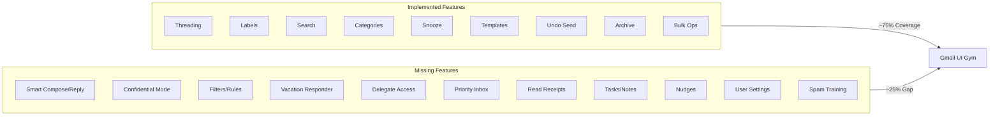

# Gmail UI Gym - Backend Feature Gap Analysis

Based on comparing the `docs/Gmail UI Gym.pdf` documentation against the `backend/` implementation, here are the features NOT captured:---

## Features Already Implemented (Reference)

| Feature | Backend Location | Notes |

|---------|------------------|-------|

| Conversation View/Threading | `thread_id`, `parent_email_id` in Email model | Complete |

| Hierarchical Labels | [labels.py](backend/app/api/v1/endpoints/labels.py) with `parent_id` | Complete |

| Search Operators | [search.py](backend/app/api/v1/endpoints/search.py) | `from:`, `to:`, `is:`, `has:`, `label:`, etc. |

| Inbox Categories | `EmailCategory` enum (primary/social/promotions/updates/forums) | Complete |

| Snooze | `snooze_until` field + endpoints | Complete |

| Templates | [templates.py](backend/app/api/v1/endpoints/templates.py) | Full CRUD |

| Undo Send | `scheduled_send_at`, `QUEUED` status, cancel-send endpoint | Complete |

| Archive vs Delete | `ARCHIVED` status + Trash folder | Complete |

| Bulk Operations | [bulk.py](backend/app/api/v1/endpoints/bulk.py) | Complete |

| Attachments | [attachments.py](backend/app/api/v1/endpoints/attachments.py) | Complete |

| Reply/Reply-All/Forward | [emails.py](backend/app/api/v1/endpoints/emails.py) | Complete |---

## Missing Features (Not Implemented)

### 1. Smart Compose and Smart Reply (Doc Section 1.5)

**Documentation:** "Predictive AI suggests sentence completions (Smart Compose) and generates rapid, one-tap response buttons (Smart Reply)"**Gap:** No API endpoints or models for AI-powered text suggestions. Would need:

- `GET /api/v1/emails/{id}/smart-replies` - suggested responses
- `GET /api/v1/compose/suggestions` - predictive text completions

---

### 2. Confidential Mode (Doc Section 1.7)

**Documentation:** "Enables senders to set expiration dates for sensitive emails and revoke access to attachments after sending. Can require SMS passcode."**Gap:** Email model lacks:

- `expires_at` / `expiration_date` field
- `is_confidential` boolean
- `passcode_required` boolean
- Access revocation mechanism
- No endpoint to revoke sent email access

---

### 3. Filters / Automation Rules (Doc Section 1.10)

**Documentation:** "An automation engine that allows users to create If/Then rules. Example: If email is from @vendor.com, Skip Inbox AND Apply Label Invoices."**Gap:** No `Filter` model or endpoints. Would need:

- `Filter` model with conditions (from, to, subject, has_attachment) and actions (label, archive, delete, star, forward)
- `POST/GET/PUT/DELETE /api/v1/filters` endpoints
- Background task to apply filters on incoming emails

---

### 4. Vacation Responder / Auto-Reply (Doc Section 1.19)

**Documentation:** "An automated system that sends a customized reply to incoming messages during a specified date range, with options to restrict replies to people in contacts."**Gap:** User model lacks:

- `vacation_enabled` boolean
- `vacation_start_date` / `vacation_end_date`
- `vacation_subject` / `vacation_body`
- `vacation_contacts_only` boolean
- No background task to send auto-replies

---

### 5. Delegate Access (Doc Section 1.20)

**Documentation:** "Allows a user to grant inbox access to another user. The delegate can read, send, and delete mail on behalf of the account owner."**Gap:** No delegation system. Would need:

- `InboxDelegate` model (delegator_id, delegate_id, permissions)
- Endpoints to grant/revoke access
- RBAC modifications to check delegate permissions

---

### 6. Multiple Inboxes / Priority Inbox (Doc Sections 1.12, 1.14)

**Documentation:** "Configure inbox view to display up to five separate panels" and "Priority Inbox splits message list into Important and Unread, Starred, Everything Else"**Gap:** No user inbox configuration. Would need:

- `UserInboxSettings` model for custom inbox panels
- `inbox_type` preference (default, priority, multiple)
- No algorithmic importance learning

---

### 7. Read Receipts (Doc Workflow 1)

**Documentation:** "User clicks More options menu to Request a Read Receipt"**Gap:** No read receipt functionality:

- `read_receipt_requested` field on emails
- Tracking when recipient opens email
- Notification to sender when read

---

### 8. Right-Side Panel Integrations - Tasks and Keep (Doc Section 3.1)

**Documentation:** "The Right-Side Panel gives immediate access to productivity tools like Google Tasks and Keep"**Gap:** No Task or Note models integrated with emails:

- `Task` model linked to emails
- `Note` model linked to emails
- Endpoints for task/note creation from emails

---

### 9. Offline Mode Sync (Doc Section 1.16)

**Documentation:** "Synchronizes a subset of mail to the local browser cache"**Gap:** No sync state management:

- No `sync_token` for incremental sync
- No `GET /api/v1/sync/changes` endpoint for delta updates

---

### 10. Nudges (Doc Section 7)

**Documentation:** "Nudges (reminders to reply) - These features rely on scanning message content to infer intent"**Gap:** No reminder system for:

- Emails needing reply
- Emails to follow up on
- No `nudge_type` or `needs_followup` fields

---

### 11. User Settings / Quick Settings (Doc Section 3.1)

**Documentation:** "Quick Settings allows for immediate visual customization such as density, theme adjustments"**Gap:** User model lacks preferences:

- `theme` (light/dark)
- `density` (default/comfortable/compact)
- `reading_pane` preference
- Keyboard shortcuts enabled/disabled

---

### 12. Spam Classification Training (Doc Flow 12)

**Documentation:** "User marks message as Not Spam and returns it to Inbox, improving future classification"**Gap:** While Spam folder exists, there's no:

- `POST /api/v1/emails/{id}/not-spam` endpoint
- Spam classification model training
- `report_spam` / `report_not_spam` actions

---

### 13. Importance Markers Training (Doc Section 1.17)

**Documentation:** "Users can manually toggle importance markers to train the algorithm"**Gap:** `is_important` field exists but:

- No learning/training mechanism
- No auto-importance assignment based on signals

---

### 14. Schedule Send with Presets (Doc Workflow 2)

**Documentation:** "Modal appears offering Tomorrow morning, This afternoon, or Pick date and time"**Gap:** `scheduled_send_at` exists but no:

- Preset time suggestions endpoint
- User timezone preference

---

## Summary Diagram

---

## Recommended Priority for Implementation

| Priority | Feature | Effort | Business Value |

|----------|---------|--------|----------------|

| High | Filters/Automation Rules | Medium | Core email workflow |

| High | Vacation Responder | Low | Common enterprise need |

| High | Spam Training (Not Spam) | Low | Improves UX |

| Medium | User Settings/Preferences | Low | Customization |

| Medium | Read Receipts | Low | Business tracking |

| Medium | Delegate Access | High | Enterprise feature |

| Low | Smart Compose/Reply | Very High | Requires AI/ML |

| Low | Confidential Mode | Medium | Security feature |